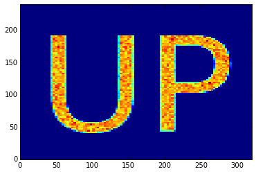
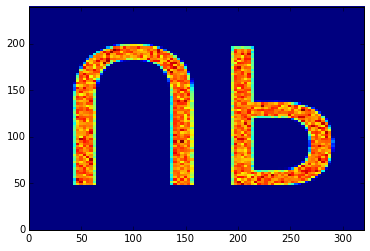

Simpact Cyan - 0.19.2
=====================

This document is the reference documentation for the Simpact Cyan
program, the C++ version of the [Simpact](http://www.simpact.org)
family of programs. 
The program is most easily controlled through either the Python or
R bindings, using the `pysimpactcyan` module and `RSimpactCyan`
package respectively; the way to use them is described below.
The Python bindings are included in the Simpact Cyan package, the R 
bindings need to be installed separately from within R.

Apart from this document, there exists some additional documentation
as well:

 - Documentation of the program code itself can be found here: 
   [code documentation](documentation/index.html).
 - A tutorial for using the R bindings: [Age-mixing tutorial Bruges 2015](http://rpubs.com/wdelva/agemixing)
 

The Simpact Cyan installers, as well as the source code for the
program, can be found in the ['programs'](http://research.edm.uhasselt.be/jori/simpact/programs/).
directory. If you're using MS-Windows, you'll need to install the 
[Visual Studio 2013 redistributable package](https://www.microsoft.com/en-us/download/details.aspx?id=40784)
as well (use the **x86** version) to be able to use the installed version. 

In case you're interested in [running simulations from R](#startingfromR),
you'll need to have a working
Python version installed as well. For MS-Windows this is typically not
installed by default; when installing this it's best to use the default
directory (e.g. `C:\Python27` or `C:\Python34`). 

Introduction
------------

Like other members of the Simpact family, Simpact Cyan is an 
[agent based model (ABM)](http://en.wikipedia.org/wiki/Agent-based_model) to 
study the way an infection spreads and can be influenced, and is currently 
focused on HIV. 
The program models each individual in a population of a specified
initial size. Things that can happen are represented by _events_, which
can have a certain risk of being executed at a certain moment. Time advances
by iteratively finding the next event that will take place, updating the time
to the corresponding value and executing event-specific code. 
The way this is implemented, is using the _Modified Next Reaction
Method_ [[Anderson]](#ref_anderson).

Note that event times and time-related properties that can be configured
are expressed in units of years, unless stated otherwise.

### Modified Next Reaction Method (mNRM) & hazards ###

In the mNRM algorithm, there is a core distinction between _internal event times_
and _real-world event times_. The internal event times determine when an event
will go off according to some notion of an internal clock. Let's call the
_internal_ time interval until a specific event fires $\Delta T$. Such internal
time intervals are chosen using a simple method, typically as random numbers picked
from an exponential distribution:

$$ {\rm prob}(x)dx = \exp(-x)dx $$

Events in the simulation will not just use such internal times, they need to be
executed at a certain real-world time. Calling $\Delta t$ the real-world time interval 
that corresponds to the internal time interval $\Delta T$, this mapping is done
using the notion of a _hazard_ (called _propensity function_ in the mNRM article) $h$:

$$ \Delta T = \int_{t_{\rm prev}}^{t_{\rm prev}+\Delta t} h(X(t'), t') dt' $$

It is this hazard that can depend on the state $X$ of the simulation, and perhaps
also explicitly on time. The state of the simulation in our case, can be thought of
as the population: who has relationships with whom, who is infected, how many people
are there etc. This state $X(t)$ does _not_ continuously depend on time: the state
only changes when events get fired, which is when their internal time interval passes.
Note that the formula above is for a single event, and while $\Delta T$ itself is
not affected by other events, the mapping into $\Delta t$ certainly can be: other
events can change the state, and the hazard depends on this state.

The figure below illustrates the main idea: internal time intervals are chosen from
a certain distribution, and they get mapped onto real-world time intervals through
hazards. Because hazards can depend both on the state (so the time until an event
fires can be influenced by other events that manipulate this state), and can have an 
explicit time dependency, this mapping can be quite complex:

The hazard can cause complex behaviour, but of course this is not necessarily the case. If
one uses a constant hazard, this simply causes a scaling between internal time $\Delta T$
and real-world time $\Delta t$:
$$ \Delta T = h \Delta t \quad \text{(for a constant hazard)} $$
This also illustrates that the higher the hazard, the earlier the event will fire, i.e.
the real-world time interval will be smaller.

As an example, let's consider [formation events](#formation). At a certain time in
the simulation, many formation events will be scheduled, one event for each man/woman
pair that can possibly form a relationship. The internal time interval for each of
these events will simply be picked from the simple exponential distribution that was
mentioned above. The mapping to a real-world time at which the event will fire, is
calculated using the hazard-based method, and this hazard depends on many things
(the state): how many relationships does the man have at a certain time, how many relationships
does the woman have, what is the preferred age difference etc. One can also imagine
that there can be an explicit time dependency in the hazard: perhaps the hazard of
forming a relationship increases if the time since the relationship became possible
goes up.

Using an exponential distribution to generate an internal time interval is how the
method is described in the [[Anderson]](#ref_anderson) article. It is of course not absolutely necessary
to do this, and other ways to generate an internal time are used as well. The simplest
example, is if one wants to have an event that fires at a specific time. In that case,
$\Delta T$ can simply be set to the actual real-world time until the event needs to fire,
and the hazard can be set to $h=1$, so that internal and real-world time intervals match.
Among others, this is done in the [HIV seeding](#hivseeding) event which, when triggered, starts the
epidemic by marking a certain amount of people as infected.

### Population based simulation ###

Each time an event is triggered, the state of the simulation is allowed to change. Because
the hazard of any event can depend on this state, in the most general version of the mNRM 
algorithm, one would recalculate the real-world event fire times of all remaining events
each time a particular event gets triggered. This ensures that the possibly changed state
is taken into account.
Recalculating all event fire times all the time, is of course very inefficient: although
the state may have been changed somewhat, this change may not be relevant for many of
the event hazards in use. As a result, the calculated real-world fire times would be mostly the
same as before. 

In the Simpact model, the state can be thought of as the population that is being simulated,
where the population consists of persons. Each person is linked to a list of events
that involve him or her, and if an event is relevant to more than one person it will be
present in the lists of more than one person. For example, a [mortality event](#mortality)
would be present in the list of only one person, while a [relationship formation event](#formation)
is about two distinct people and would therefore be present in two such lists. The figure
below illustrates this idea:

When an event fires, it is assumed that only the properties of a very limited set of people
have changed, and that one only needs to recalculate the fire times of the events in those
people's lists. For example, if `Event 2` from the figure above fires, then the real-world
fire times for the events in the lists of `Person A` and `Person B` will be automatically
recalculated. Apart from affecting the people in whose lists an event appears, an event can
also indicate that other people are affected. As an example, a [birth event](#birth) will only
appear in the list of the woman who's pregnant. However, when triggered this event indicates
that the father is also an affected person (in case the amount of children someone has is used
in a hazard). In general, this number of other affected people will be very small compared to
the size of the population, causing only a fraction of the event fire times to be recalculated.
This allows this _population-based algorithm_ to run much faster than the very basic algorithm
that always recalculates all event times.

Besides these types of events, there are also 'global' events. These events do not refer
to a particular person and will modify the state in a very general way. In general, when
such a global event is triggered, this causes _all_ other event fire times to be recalculated.

### 'Time limited' hazards ###
 
In the mNRM algorithm, time advances in steps, from one event fire time to the next. In general,
these event fire times are calculated by mapping a generated _internal_ time interval $\Delta T$ onto a
_real-world_ time interval $\Delta t$ using the formula

$$ \Delta T = \int_{t_{\rm prev}}^{t_{\rm prev}+\Delta t} h(X(t'), t') dt' $$

where $h$ is the hazard that can have an explicit time dependency and a dependency on the
simulation state. While the simulation state can change over time, it can only change at discrete
points, when other events change the state. 

The form of the hazard determines how fast this mapping between internal times and real-world times
can be calculated. To keep the simulation as fast as possible, hazards for which the integral has an
analytic solution are certainly most interesting. Furthermore, because the mapping between internal
and real-world times needs to be done in each direction, the resulting equation for $\Delta T$
needs to be invertible as well.

The hazards that we use in the Simpact events are often of the form

$$ {\rm hazard} = \exp(A+Bt) $$

This is a time dependent hazard where $A$ and $B$ are determined by other values in the simulation
state. The nice feature of such a hazard is that it is always positive, as a hazard should be (otherwise
the mapping could result in simulation time going backwards). Unfortunately, this form also has a
flaw: consider the example where $A = 0$, $B = -1$ and $t_{\rm prev} = 0$ for conciseness. The mapping
between times then becomes

$$\Delta T = \int_0^{\Delta t} \exp(-t') dt' = 1 - \exp(-\Delta t) $$

When we need to map a specific $\Delta t$ onto an internal $\Delta T$, this expression can be used to
do this very efficiently. When we need the reverse, rewriting this equation gives:

$$\Delta t = -\log(1-\Delta T) $$

From this it is clear that it is only possible if $\Delta T$ is smaller than one, which may not
be the case since $\Delta T$ is picked from an exponential probability distribution in general. The
core problem is that the integral in our expression is bounded, suggesting an upper limit on $\Delta T$,
but on the other hand that $\Delta T$ needs to be able to have any positive value since it is
picked from an exponential distribution which does not have an upper limit.

To work around this, we use a slightly different hazard, one that becomes constant after a certain
time $t_{\rm max}$, as is illustrated in the figure below. This has the effect that the integral
will no longer have an upper bound, and the mapping from $\Delta T$ to $\Delta t$ will always be
possible.

We are calculating a different hazard than before of course, so you may wonder whether this is
really a good idea. In this respect, it is important to note that we're simulating individuals
that will not live forever, but have a limited lifespan. So if we set $t_{\rm max}$ 
to the time at which the relevant person would be 200 years old (for example), we can be very
sure that our choice for $t_{\rm max}$ will not affect the simulation. It only helps to keep
the calculations feasible.

Above, the basic problem and solution are illustrated using a simple time dependent exponential
hazard, but it should be clear that the problem occurs for other hazards as well: one only needs
a hazard for which the integral above is bounded, and since choosing $\Delta T$ from an exponential
probability distribution can yield any value, problems will occur. The solution in the general case
is the same: set the hazard to a constant value after a $t_{\rm max}$ value which exceeds the
lifetime of a person. The detailed calculations for this procedure can be found in this document:
[hazard_tmax.pdf](hazard_tmax.pdf)

Configuration and running of a simulation
-----------------------------------------

The basic Simpact Cyan program is a standalone command-line program. To be able to
set up a simulation, you'd need to prepare a configuration file and specify this
file as a command-line argument. Preparing the configuration file manually is
time-consuming work, as all event properties necessary in a simulation need to
be set.
To make it easier to prepare and run simulations, there's a `pysimpactcyan` module
that you can use to control Simpact Cyan from Python, or alternatively there's
a `RSimpactCyan` library that you can install in R that provides a similar
interface. The Python module is included when you install the Simpact Cyan binaries,
the R library must be installed separately from an R session.

You can also use a combined approach: first run a simulation or simply prepare a
configuration file from R or Python, and subsequently use this configuration
to start one or more simulations. This can be very helpful to first prepare a
base configuration file in an easy way, and then to launch one or more simulations
on a computer cluster for example. For this particular case, it can be very
helpful to override e.g. a prefix on the output files as explained [below](#configfile).

In this section, we briefly look into starting the simpact cyan program on the
command line, followed by explanations of how the [Python interface](#startingfromPython)
or [R interface](#startingfromR) works. Some insights into the [configuration file](#configfile)
are given next, since that is the actual input to the simulation. Typically, if
you can specify a particular probability distribution in the configuration file,
you can also specify others. At the end of this section we describe 
[which distributions](#probdists) are supported and what their parameters are.

### Running from command line ###

The Simpact Cyan executable that you're likely to need is called `simpact-cyan-release`.
There is a version with debugging information as well: this performs exactly the same calculations, but
has more checks enabled. As a command line argument you can specify if the very basic
mNRM (in which all event times are recalculated after triggering an event) is to be
used, or the more advanced version (in which the program recalculates far less event
fire times). While `simpact-cyan-release` with the advanced mNRM algorithm is the
fastest, it may be a good idea to verify from time to time that the simple algorithm
yields the same results (when using the same random number generator seed), as well
as the debug versions.

The program needs three additional arguments, the first of which is the path to the
configuration file that specifies what should be simulated. The configuration file
is just a text file containing a list of key/value pairs, a part of which could 
look like this:

    ...
    population.nummen    = 200
    population.numwomen  = 200
    population.simtime   = 40
    ...

You can also define variables and use environment variables of your system, [later](#configfile)
we'll look into this config file in more detail. All configuration options and their
possible values are described in the section with the [simulation details](#simdetails).
For the configuration file itself, _all_ options that are needed in the simulation
_must_ be set, no default values are assumed by the command line program. When using the
R or Python interface however, this helper system does know about default values
thereby severely limiting the number of options that must be specified. It will combine the
options you specify with the defaults to produce a full configuration file that the
command line program can use.

The second argument that the `simpact-cyan-release` program needs is either 0 or 1 and
specifies whether the single core version should be used (corresponds to `0`), 
or the version using multiple cores (corresponds to `1`). For the parallel version,
i.e. the version using multiple cores, [OpenMP](https://en.wikipedia.org/wiki/OpenMP)
is used as the underlying technology. By default the program will try to use all
processor cores your system has, but this can be adjusted by setting the
`OMP_NUM_THREADS` environment variable.
In general, it is a good idea to specify `0` for this option, selecting the single-core
version. The parallel version currently only offers a modest speedup, and only for very
large population sizes. Especially if you need to do several runs of a simulation, starting
several single-core versions at once will use your computer's power more efficiently
than starting several parallel versions in a sequential way. 

With the third and final argument you can specify which mNRM algorithm to use: if you
specify 'simple', the basic mNRM is used in which all event fire times will be
recalculated after an event was triggered. Since this is a slow algorithm, you'll
probably want to specify 'opt' here, to use the more advanced algorithm. In this
case, the procedure explained above is used, where each user stores a list of
relevant events.

So, assuming we've created a configuration file called `myconfig.txt` that resides in
the current directory, we could run the corresponding simulation with the following
command:

    simpact-cyan-release myconfig.txt 0 opt

This will produce some output on screen, such as which version of the program is
being used and which random number generator seed was set. Since the random number
generator seed is in there, it may be a good idea to save this to a file in case
you'd like to reproduce the exact simulation later. To save it to a file called
`myoutput.txt`, you can run

    simpact-cyan-release myconfig.txt 0 opt 2>myoutput.txt

Note that it is not a redirection of the output using simply `>`, but using `2>`.
This has to do with the fact that the information that you see on screen is actually
sent to [`stderr`](https://en.wikipedia.org/wiki/Standard_streams) instead of
`stdout`.

When running the Simpact Cyan program, the default behaviour is to initialize the
random number generator with a (more or less) random seed value. For reproducibility
it may be necessary to enforce a specific seed. To do so, set the environment variable
`MNRM_DEBUG_SEED` to the value you want to use, and verify in the output of the
program that the specified seed is in fact the one being used:

 - for an MS-Windows system:

        set MNRM_DEBUG_SEED=12345
        simpact-cyan-release myconfig.txt 0 opt

    Note that value of `MNRM_DEBUG_SEED` is still set, which is important when running
    additional simulations. To clear it, either exit the current command prompt, or
    execute

        set MNRM_DEBUG_SEED=

    (nothing may be specified after the `=` sign, not even a space)

 - for a Linux or OS X system:

        export MNRM_DEBUG_SEED=12345
        simpact-cyan-release myconfig.txt 0 opt

    Note that value of `MNRM_DEBUG_SEED` is still set, which is important when running
    additional simulations. To clear it, either exit the current terminal window, or
    execute

        unset MNRM_DEBUG_SEED

    On one of these operating systems, it is also possible to specify everything in
    one line:

        MNRM_DEBUG_SEED=12345 simpact-cyan-release myconfig.txt 0 opt

    In this case, the value of `MNRM_DEBUG_SEED` will be visible to the program,
    but will no longer be set once the program finishes. It will therefore not
    affect other programs that are started.

### Running from within R ###

#### Getting started ####

The R interface to Simpact Cyan will underneath still execute one of the
Simpact Cyan programs, e.g. `simpact-cyan-release`, so the [program](#programs)
relevant to your operating system must be installed first. Note that if
you're using MS-Windows, you'll also need to install the 
[Visual Studio 2013 redistributable package](https://www.microsoft.com/en-us/download/details.aspx?id=40784)
(use the **x86** version).

The R module actually contains Python code so to be able to use this, you'll
need to have a working Python installation. On Linux or OS X, this is usually
already available, but if you're using MS-Windows you may need to install this
separately. In this case, it is best to install it in the default directory,
e.g. `C:\Python27` or `C:\Python34`, so that the R package will be able to
locate it easily.

Before being able to use the `RSimpactCyan` module, you need to make sure that other
libraries are available:

    install.packages("RJSONIO")
    install.packages("findpython")
    install.packages("rPithon", repos="http://research.edm.uhasselt.be/jori")

Once these are installed, you can install the `RSimpactCyan` library which
contains the R interface to the Simpact Cyan program:

    install.packages("RSimpactCyan", repos="http://research.edm.uhasselt.be/jori")

Finally, you can load the library with the command:

    library("RSimpactCyan")

#### Running a simulation ####

To configure a simulation, you need to specify the options for which you want
to use a value other than the default. This is done using a list, for example

    cfg <- list()
    cfg["population.nummen"] <- 200
    cfg["population.numwomen"] <- 200
    cfg["population.simtime"] <- 40

All values that are entered this way are converted to character strings when
creating a configuration file for the simulation. This means that instead of
a numeric value, you could also use a string that corresponds to the same
number, for example

    cfg["population.nummen"] <- "200"

Together with the defaults for other options, these settings will be combined into
a configuration file that the real Simpact Cyan program can understand. Taking
a look at the full configuration file will show you what other values are in use;
to see this configuration file, run

    simpact.showconfig(cfg)

Lines that start with a `#` sign are ignored when the configuration file is read.
They may contain comments about certain options, or show which options are not
in use currently. In case you'd want to use a simulation using all defaults, you can either use an
empty list, or specify `NULL`. 

If you've got the configuration you'd like to use,
you can start the simulation from within R with the command `simpact.run`. Two
parameters _must_ be specified: the first is the settings to use (the `cfg` list
in our example) and the second is a directory where generated files and results
can be stored. The R module will attempt to create this directory if it does not
exist yet. To use the directory `/tmp/simpacttest`, the command would become

    res <- simpact.run(cfg, "/tmp/simpacttest")

The other parameters are:

 - `agedist`: With this parameter, you can specify the age distribution that should be used
   when generating an initial population. The default is the age distribution of
   South Africa from 2003. In R, you can specify an alternative age distribution
   in two ways. 

    The first way to do this, is to specify the age distribution as an R data frame
   or list, which contains columns named `Age`, `Percent.Male` and `Percent.Female`.
   The `Age` column should be increasing, and the other columns specify the
   probability of selecting each gender between the corresponding age and the next. Before
   the first specified age, this probability is zero, and the last mentioned
   age should have zeroes as the corresponding probabilities. The term probability
   here is not strictly correct: it can be any positive number since the resulting
   distribution will be normed. As an example

        ad <- list(Age=c(0,50,100), Percent.Male=c(1,2,0), Percent.Female=c(2,1,0))

    will correspond to an age distribution which limits the age to 100 for everyone.
   Furthermore, there will be twice as many men over 50 than under 50, while for the
   women it's the other way around.

    The other way an age distribution can be specified, is as a CSV file with (at
   least) three columns. The header of this CSV file will not be taken into account,
   instead the first column is assumed to hold the `Age` column, the second is
   interpreted as the `Percent.Male` column and the third as `Percent.Female`.

 - `intervention`: With this simulation intervention setting it is possible to change configuration
   options that are being used at specific times during the simulation. More information
   about how this can be used can be found in the explanation of the 
   [simulation intervention event](#simulationintervention).

 - `release`, `slowalg`, `parallel`: These flags specify which precise version of the
   simulation program will be used, and whether the single-core or multi-core version
   is used. The `release` parameter is `TRUE` by default, yielding the fastest version
   of the selected algorithm. If set to `FALSE`, many extra checks are performed, all
   of which should pass if the algorithm works as expected.
   
    By default, `slowalg` is `FALSE` which selects the population-based
   procedure described above. In case this is set to `TRUE`, the very basic mNRM algorithm is
   used, where all event fire times are recalculated after each event is executed.
   If all works as expected, the two algorithms should produce the same results for
   the same seed (although very small differences are possible due to limited
   numeric precision). The basic algorithm is very slow, keep this in mind if you
   use it.

    The `parallel` parameter is `FALSE` by default, selecting the version of the
   algorithm that only uses a single processor core. To use the parallel version,
   i.e. to use several processor cores at the same time, this can be set to `TRUE`.
   The parallel version currently only offers a modest speedup, and only for very
   large population sizes. Especially if you need to do several runs of a simulation, starting
   several single-core versions at once will use your computer's power more efficiently
   than starting several parallel versions in a sequential way. 

 - `seed`: By default, a more or less random seed value will be used to initialize
   the random number generator that's being using in the simulation. In case you'd like
   to use a specific value for the seed, for example to reproduce results found earlier,
   you can set it here.

 - `dryrun`: If this is set to `TRUE`, the necessary configuration files will be
   generated, but the actual simulation is _not_ performed. This can come in handy
   to prepare a simulation's settings on your local machine and run one or more
   actual simulations on another machine, e.g. on a computer cluster. In case you'd
   like to perform several runs with the same configuration file, overriding the
   output prefix can be very helpful, as is described in the section on the
   [configuration file](#configfile). If you'd like to perform a run that has been
   prepared this way from within R, you can use the `simpact.run.direct` function.

 - `identifierFormat`: Files that are created by the simulation will all start with the 
   same identifier. The identifierFormat parameter specifies what this identifier should be. 
   Special properties start with a percent (%) sign, other things are just copied. An 
   overview of these special properties:

    - `%T`: will expand to the simulation type, e.g. `simpact-cyan`
    - `%y`: the current year
    - `%m`: the current month (number)
    - `%d`: the current day of the month
    - `%H`: the current hour
    - `%M`: the current minute
    - `%S`: the current second
    - `%p`: the process ID of the process starting the simulation
    - `%r`: a random character
    
    The default identifier format `%T-%y-%m-%d-%H-%M-%S_%p_%r%r%r%r%r%r%r%r-` would lead to 
   an identifier like `simpact-cyan-2015-01-15-08-28-10_2425_q85z7m1G-`.

The return value of the `simpact.run` function contains the paths to generated files
and output files, or in case the `dryrun` option was used, of files that will be written
to. The [output files](#outputfiles) that are produced are described in the corresponding
section.

#### Other functions ####

Apart from `simpact.showconfig` and `simpact.run`, some other functions exist in the
`RSimpactCyan` library as well:

 - `simpact.available`  
   This function returns a boolean value, that indicates if the `RSimpactCyan` library
   is able to find and use the Simpact Cyan simulation [program](#programs).

 - `simpact.getconfig`  
   This takes a list with config values as input, similar to `simpact.showconfig`,
   merges it with default settings, and returns the extended configuration list.
   If the second parameter ('show') is set to `TRUE`, then the full configuration
   file will be shown on-screen as well.
  
 - `simpact.run.direct`  
   This function allows you to start a simulation based on a previously created
   (e.g. using the 'dryrun' setting of `simpact.run`) configuration file. This
   config file must be set as the first argument, and is always required. Other
   arguments are optional:

    - `outputFile`: If set to `NULL`, the output of the Simpact Cyan simulation
      (containing information about the version of the program and the random
      number generator seed) will just appear on screen. If a filename is
      specified here, the output will be written to that file as well.
    - `release`, `slowalg`, `parallel`, `seed`: Same meaning as in the `simpact.run`
      function
    - `destDir`: By default, the simulation will be run in the directory that
      contains the config file. This is important if the config file itself
      specifies files without an _absolute_ path name since the directory
      of the config file will then be used as a starting point. If you don't
      want this behaviour and need to select another directory, this parameter
      can be used to set it.

 - `simpact.set.datadir`  
   The `RSimpactCyan` library will try to figure out where the Simpact Cyan
   data files are located. If you want to specify another location, this
   function can be used to do so.

 - `simpact.set.simulation`  
   The Simpact Cyan package is actually meant to support alternative simulations
   as well. To use such an alternative simulation, this function can be used.
   For example, if `maxart` is specified here, instead of running e.g.
   `simpact-cyan-release` as underlying program, `maxart-release` would be executed
   instead.

### Running from within Python ###

#### Getting started ####

The `pysimpactcyan` module to control Simpact Cyan from within Python, is 
automatically available once you've installed the [program](#programs). Note that if
you're using MS-Windows, you'll also need to install the 
[Visual Studio 2013 redistributable package](https://www.microsoft.com/en-us/download/details.aspx?id=40784)
(use the **x86** version).
To load the Simpact Cyan module in a Python script or interactive session, just execute

    import pysimpactcyan

This allows you to create an instance of the `PySimpactCyan` class that's defined in this
module, let's call it `simpact`:

    simpact = pysimpactcyan.PySimpactCyan()

#### Running a simulation ####

To configure a simulation, you need to specify the options for which you want
to use a value other than the default. This is done using a dictionary, for example

    cfg = { }
    cfg["population.nummen"] = 200
    cfg["population.numwomen"] = 200
    cfg["population.simtime"] = 40

All values that are entered this way are converted to character strings when
creating a configuration file for the simulation. This means that instead of
a numeric value, you could also use a string that corresponds to the same
number, for example

    cfg["population.nummen"] = "200"

Together with the defaults for other options, these settings will be combined into
a configuration file that the real Simpact Cyan program can understand. Taking
a look at the full configuration file will show you what other values are in use;
to see this configuration file, run

    simpact.showConfiguration(cfg)

Lines that start with a `#` sign are ignored when the configuration file is read.
They may contain comments about certain options, or show which options are not
in use currently. In case you'd want to use a simulation using all defaults, you can either use an
empty dictionary, or specify `None`. 

If you've got the configuration you'd like to use,
you can start the simulation from within Python using the `run` method of the
Simpact Cyan object you're using. Two
parameters _must_ be specified: the first is the settings to use (the `cfg` dictionary
in our example) and the second is a directory where generated files and results
can be stored. The Python module will attempt to create this directory if it does not
exist yet. To use the directory `/tmp/simpacttest`, the command would become

    res = simpact.run(cfg, "/tmp/simpacttest")

The other parameters are:

 - `agedist`: With this parameter, you can specify the age distribution that should be used
   when generating an initial population. The default is the age distribution of
   South Africa from 2003. In Python, you can specify an alternative age distribution
   in two ways. 

    The first way to do this, is to specify the age distribution as a dictionary
   which contains lists of numbers named `Age`, `Percent.Male` and `Percent.Female`.
   The `Age` list should be increasing, and the other lists specify the
   probability of selecting each gender between the corresponding age and the next. Before
   the first specified age, this probability is zero, and the last mentioned
   age should have zeroes as the corresponding probabilities. The term probability
   here is not strictly correct: it can be any positive number since the resulting
   distribution will be normed. As an example

        ad = { "Age": [0, 50, 100], "Percent.Male": [1, 2, 0], "Percent.Female": [2, 1, 0] }

    will correspond to an age distribution which limits the age to 100 for everyone.
   Furthermore, there will be twice as many men over 50 than under 50, while for the
   women it's the other way around.

    The other way an age distribution can be specified, is as a CSV file with (at
   least) three columns. The header of this CSV file will not be taken into account,
   instead the first column is assumed to hold the `Age` column, the second is
   interpreted as the `Percent.Male` column and the third as `Percent.Female`.

 - `parallel`, `opt`, `release`: These flags specify which precise version of the
   simulation program will be used, and whether the single-core or multi-core version
   is used. The `release` parameter is `True` by default, yielding the fastest version
   of the selected algorithm. If set to `False`, many extra checks are performed, all
   of which should pass if the algorithm works as expected.
   
    By default, `opt` is `True` which selects the population-based
   procedure described above. In case this is set to `False`, the very basic mNRM algorithm is
   used, where all event fire times are recalculated after each event is executed.
   If all works as expected, the two algorithms should produce the same results for
   the same seed (although very small differences are possible due to limited
   numeric precision). The basic algorithm is very slow, keep this in mind if you
   use it.

    The `parallel` parameter is `False` by default, selecting the version of the
   algorithm that only uses a single processor core. To use the parallel version,
   i.e. to use several processor cores at the same time, this can be set to `True`.
   The parallel version currently only offers a modest speedup, and only for very
   large population sizes. Especially if you need to do several runs of a simulation, starting
   several single-core versions at once will use your computer's power more efficiently
   than starting several parallel versions in a sequential way. 

 - `seed`: By default, a more or less random seed value will be used to initialize
   the random number generator that's being using in the simulation. In case you'd like
   to use a specific value for the seed, for example to reproduce results found earlier,
   you can set it here.

 - `interventionConfig`: With this simulation intervention setting it is possible to change configuration
   options that are being used at specific times during the simulation. More information
   about how this can be used can be found in the explanation of the 
   [simulation intervention event](#simulationintervention).

 - `dryRun`: If this is set to `True`, the necessary configuration files will be
   generated, but the actual simulation is _not_ performed. This can come in handy
   to prepare a simulation's settings on your local machine and run one or more
   actual simulations on another machine, e.g. on a computer cluster. In case you'd
   like to perform several runs with the same configuration file, overriding the
   output prefix can be very helpful, as is described in the section on the
   [configuration file](#configfile). If you'd like to perform a run that has been
   prepared this way from within Python, you can use the `runDirect` method of
   the `PySimpactCyan` class.

 - `identifierFormat`: Files that are created by the simulation will all start with the 
   same identifier. The identifierFormat parameter specifies what this identifier should be. 
   Special properties start with a percent (%) sign, other things are just copied. An 
   overview of these special properties:

    - `%T`: will expand to the simulation type, e.g. `simpact-cyan`
    - `%y`: the current year
    - `%m`: the current month (number)
    - `%d`: the current day of the month
    - `%H`: the current hour
    - `%M`: the current minute
    - `%S`: the current second
    - `%p`: the process ID of the process starting the simulation
    - `%r`: a random character
    
    The default identifier format `%T-%y-%m-%d-%H-%M-%S_%p_%r%r%r%r%r%r%r%r-` would lead to 
   an identifier like `simpact-cyan-2015-01-15-08-28-10_2425_q85z7m1G-`.

The return value of the `run` method contains the paths to generated files
and output files, or in case the `dryRun` option was used, of files that will be written
to. The [output files](#outputfiles) that are produced are described in the corresponding
section.

#### Other functions ####

Apart from the  `PySimpactCyan` methods `showConfiguration` and `run`, some other methods
exist in this Python class as well:

 - `getConfiguration`  
   This takes a dictionary with config values as input, similar to `showConfiguration`,
   merges it with default settings, and returns the extended configuration dictionary.
   If the second parameter ('show') is set to `True`, then the full configuration
   file will be shown on-screen as well.
  
 - `runDirect`  
   This function allows you to start a simulation based on a previously created
   (e.g. using the 'dryRun' setting of `run`) configuration file. This
   config file must be set as the first argument, and is always required. Other
   arguments are optional:

    - `outputFile`: If set to `None`, the output of the Simpact Cyan simulation
      (containing information about the version of the program and the random
      number generator seed) will just appear on screen. If a filename is
      specified here, the output will be written to that file as well.
    - `release`, `opt`, `parallel`, `seed`: Same meaning as in the `run`
      method.
    - `destDir`: By default, the simulation will be run in the directory that
      contains the config file. This is important if the config file itself
      specifies files without an _absolute_ path name since the directory
      of the config file will then be used as a starting point. If you don't
      want this behaviour and need to select another directory, this parameter
      can be used to set it.

 - `setSimpactDataDirectory`  
   The `pysimpactcyan` module will try to figure out where the Simpact Cyan
   data files are located. If you want to specify another location, this
   function can be used to do so.

 - `setSimpactDirectory`  
   In case you want to specify that the Simpact Cyan executables are located
   in a specific directory, you can use this function.

 - `setSimulationPrefix`
   The Simpact Cyan package is actually meant to support alternative simulations
   as well. To use such an alternative simulation, this function can be used.
   For example, if `maxart` is specified here, instead of running e.g.
   `simpact-cyan-release` as underlying program, `maxart-release` would be executed
   instead.

### Configuration file and variables ###

The actual program that executes the simulation reads its settings from a certain
configuration file. This is also the case when running from R or Python, where
the R or Python interface prepares the configuration file and executes the
simulation program. While this approach makes it much easier to configure and
run simulations, some knowledge of the way the configuration file works can
be helpful.

#### The basics ####

In essence, the configuration file is just a text file containing key/value pairs.
For example, the line

    population.simtime = 100

assigns the value 100 to the simulation setting `population.simtime`, indicating
that the simulation should run for 100 years. Lines that start with a hash sign (`#`)
are not processed, they can be used for comments. In the config file itself, mathematical
operations are not possible, but if you're using R or Python, you can perform the
operation there, and only let the result appear in the config file. For example, if
you'd do

    library("RSimpactCyan")
    cfg <- list()
    cfg["population.simtime"] = 100/4
    simpact.showconfig(cfg)

in an R session, you'd find 

    population.simtime = 25

in the configuration file. We could force '100/4' to appear in the configuration file by
changing the line to

    cfg["population.simtime"] = "100/4"

(so we added quotes), but when trying to run the simulation this would lead to the
following error:

    FATAL ERROR:
    Can't interpret value for key 'population.simtime' as a floating point number

#### Config file variables and environment variables ####

Keys that start with a dollar sign (`$`) are treated in a special way: they define
a variable that can be used further on in the configuration file. To use a variable's
contents in the value part of a config line, the variable's name
should be placed between `${` and `}`. For example, we could first have set

    $SIMTIME = 100

thereby assigning `100` to the variable with name `SIMTIME`. This could then later be 
used as follows:

    population.simtime = ${SIMTIME}

You don't even need to define the variable inside the configuration file: if you
define an environment variable, you can use its contents in the same way as before.
For example, if the `HOME` environment variable has been set to `/Users/JohnDoe/`,
then the lines

    periodiclogging.interval            = 2
    periodiclogging.outfile.logperiodic = ${HOME}periodiclog.csv

would enable the [periodic logging event](#periodiclogging) and write its output
every other year to `/Users/JohnDoe/periodiclog.csv`.

One very important thing to remember is that if an environment variable with the same
name as a config file variable exists, **the environment variable will always take
precedence over config file variables**. While this might seem a bit odd, it actually
allows you to more easily use config files prepared on one system, on another system.
Furthermore, it allows you to use a single config file multiple times, which can be
very handy if you need to perform many runs using the same settings (but different
output files).

#### Using environment variables ####

When you let the R or Python interface prepare a configuration file, this file
will start by defining two config file variables, for example:

    $SIMPACT_OUTPUT_PREFIX = simpact-cyan-2015-05-27-08-28-13_27090_8Al7O6mD-
    $SIMPACT_DATA_DIR = /usr/local/share/simpact-cyan/

The first variable is used in the config file when specifying which files to
write output to. As an example, you'd also find the line

    logsystem.outfile.logevents = ${SIMPACT_OUTPUT_PREFIX}eventlog.csv

in that file, so the full output file name would be

    simpact-cyan-2015-05-27-08-28-13_27090_8Al7O6mD-eventlog.csv

The second variable specifies the location that R or Python thinks
the Simpact Cyan data files are stored in, and is used in the line that specifies
which age distribution to use when initializing the population:

    population.agedistfile = ${SIMPACT_DATA_DIR}sa_2003.csv

In this case, the file `/usr/local/share/simpact-cyan/sa_2003.csv` would be
used to read the initial age distribution from.

Because those config variables are defined inside the configuration file, such
a file can be used on its own. If you'd first prepared the config file using the
'dryrun' setting, you could still use the created config file to start the 
simulation, either directly on the command line, using `simpact.run.direct` from R,
or using the `PySimpactCyan` method `runDirect` in Python.

If you're running from the [command line](#commandline), it's very easy
to reuse the same configuration file for multiple runs. Normally if you'd
try this, you'd see an error message like

    FATAL ERROR:
    Unable to open event log file: 
    Specified log file simpact-cyan-2015-05-27-08-28-13_27090_8Al7O6mD-eventlog.csv already exists

To make sure that you don't lose data from simulations you've already performed,
the simulation will not start if it needs to overwrite an output file, which is
what causes this message. 

However, because we can easily override the value of
`SIMPACT_OUTPUT_PREFIX` from the command line by using an environment variable
with the same name, it becomes possible to reuse the configuration file multiple
times. For example, assuming that our config file is called `myconfig.txt`, 
the simple [bash](https://en.wikipedia.org/wiki/Bash_(Unix_shell)) script

    for i in 1 2 3 4 5 ; do
        SIMPACT_OUTPUT_PREFIX=newprefix_${i}- simpact-cyan-release myconfig.txt 0 opt
    done

would produce output files like `newprefix_1-eventlog.csv` and `newprefix_5-eventlog.csv`.

In a similar way, setting an environment variable called `SIMPACT_DATA_DIR`
can be helpful when preparing simulations on one system and running them on
another. For example, you could prepare the simulations on your laptop, using the
'dryrun' option to prevent the simulation from actually running, and execute
them on e.g. a computer cluster where you set the `SIMPACT_DATA_DIR` environment
variable to make sure that the necessary data files can still be found.

### Supported probability distributions and their parameters ###

If a configuration option ends with `.dist.type` or `.dist2d.type`, for example
option `birth.pregnancyduration.dist.type` of the [birth event](#birth), you can
specify a number of probability distributions there. By choosing a specific
type of probability distribution, you also activate a number of other options
to configure the parameters of this probability distribution.

For example, if `birth.pregnancyduration.dist.type` is set to `normal`, then
parameters of the [one dimensional normal distribution](#normal1d) need to be
configured. For example, we could set `birth.pregnancyduration.dist.normal.mu`
to 0.7342 and `birth.pregnancyduration.normal.sigma` to 0.0191, and we'd get
a birth event that on average takes place after 0.7342 years (is 268 days),
with a standard deviation of roughly one week (0.0191 years).

Below you can find an overview of the currently supported [one](#prob1d) and
[two dimensional](#prob2d) distributions and their parameters.

#### One dimensional distributions ####

Here is an overview of the relevant configuration options, their defaults (between
parentheses), and their meaning:

 - `some.option.dist.type`: ('fixed'):  
   With such an option, you specify which specific distribution to choose. Allowed
   values are `beta`, `exponential`, `fixed`, `gamma`, `lognormal`, `normal`, `uniform`,
   and the corresponding parameters are given in the subsections below. Unless otherwise
   specified, the default here is a `fixed` distribution, which is not really a
   distribution but just causes a fixed value to be used. 

##### `beta` #####

If this distribution is chosen, the (scaled) beta distribution with the following
probability density is used:

$$ {\rm prob}(x) = \frac{\Gamma(a+b)}{\Gamma(a)\Gamma(b)} \left(\frac{x-x_{\rm min}}{x_{\rm max}-x_{\rm min}}\right)^{a-1}
                   \left(1-\frac{x-x_{\rm min}}{x_{\rm max}-x_{\rm min}}\right)^{b-1} \frac{1}{x_{\rm max}-x_{\rm min}} $$

This corresponds to a [beta distribution](https://en.wikipedia.org/wiki/Beta_distribution) that,
instead of being non-zero between 0 and 1, is now scaled and translated to be defined between
$x_{\rm min}$ and $x_{\rm max}$.

Here is an overview of the relevant configuration options, their defaults (between
parentheses), and their meaning:

 - `some.option.dist.beta.a` (no default):  
   Corresponds to the value of $a$ in the formula for the probability density above.
 - `some.option.dist.beta.b` (no default):  
   Corresponds to the value of $b$ in the formula for the probability density above.
 - `some.option.dist.beta.max` (no default):  
   Corresponds to the value of $x_{\rm min}$ in the formula for the probability density above.
 - `some.option.dist.beta.min` (no default):  
   Corresponds to the value of $x_{\rm max}$ in the formula for the probability density above.

##### `exponential` #####

If the exponential distribution is selected, the probability density for a negative value is
zero, while the probability density for positive values is given by:

$$ {\rm prob}(x) = \lambda \exp(-\lambda x) $$

Here is an overview of the relevant configuration options, their defaults (between
parentheses), and their meaning:

 - `some.option.dist.exponential.lambda` (no default):  
   This specifies the value of $\lambda$ in the expression of the probability density
   above.

##### `fixed` #####

This does not really correspond to a distribution, instead a predefined value is
always used.

Here is an overview of the relevant configuration options, their defaults (between
parentheses), and their meaning:

 - `some.option.dist.fixed.value` (0):  
   When a number is chosen from this 'distribution', this value is always returned.

##### `gamma` #####

In this case, the [gamma distribution](https://en.wikipedia.org/wiki/Gamma_distribution)
will be used to choose random numbers. The probability density is

$$ {\rm prob}(x) = \frac{x^{a-1} \exp\left(-\frac{x}{b}\right)}{b^a \Gamma(a)} $$

for positive numbers, and zero for negative ones.

Here is an overview of the relevant configuration options, their defaults (between
parentheses), and their meaning:

 - `some.option.dist.gamma.a` (no default):  
   This corresponds to the value of $a$ in the expression of the probability
   distribution.
 - `some.option.dist.gamma.b` (no default):  
   This corresponds to the value of $b$ in the expression of the probability
   distribution.

##### `lognormal` #####

If this [log-normal distribution](https://en.wikipedia.org/wiki/Log-normal_distribution)
is chosen, the probability density for negative numbers is zero,
while for positive numbers it is:

$$ {\rm prob}(x) = \frac{1}{x \sigma \sqrt{2\pi}} \exp\left(-\frac{(\log{x}-\zeta)^2}{2\sigma^2}\right) $$

Here is an overview of the relevant configuration options, their defaults (between
parentheses), and their meaning:

 - `some.option.dist.lognormal.sigma` (no default):  
   This corresponds to the value of $\sigma$ in the formula for the probability
   distribution.
 - `some.option.dist.lognormal.zeta` (no default):  
   This corresponds to the value of $\zeta$ in the formula for the probability
   distribution.

##### `normal` #####

The base probability distribution used when the [normal distribution](https://en.wikipedia.org/wiki/Normal_distribution)
is selected is the following:

$$ {\rm prob}(x) = \frac{1}{\sigma\sqrt{2\pi}} \exp\left(- \frac{(x-\mu)^2}{2\sigma^2}\right) $$

It is possible to specify a minimum and maximum value as well, which causes the probability
density to be zero outside of these bounds, and somewhat higher in between. A very straightforward
[rejection sampling](https://en.wikipedia.org/wiki/Rejection_sampling) method is used for
this at the moment, so it is best not to use this to sample from a narrow interval (or
in general an interval with a low probability) since this can require many iterations.

Here is an overview of the relevant configuration options, their defaults (between
parentheses), and their meaning:

 - `some.option.dist.normal.max` (+infinity):  
   This can be used to specify the maximum value beyond which the probability density
   is zero. By default no truncation is used, and this maximum is set to positive
   infinity.
 - `some.option.dist.normal.min` (-infinity):  
   This can be used to specify the minimum value below which the probability density
   is zero. By default no trunctation is used, and this minimum is set to negative
   infinity.
 - `some.option.dist.normal.mu` (no default):  
   This corresponds to the value of $\mu$ in the expression of the probability
   density above.
 - `some.option.dist.normal.sigma` (no default):  
   This corresponds to the value of $\sigma$ in the expression of the probability
   density above.

##### `uniform` #####

When this probability density is selected, each number has an equal probability
density between a certain minimum and maximum value. Outside of these bounds,
the probability density is zero.

Here is an overview of the relevant configuration options, their defaults (between
parentheses), and their meaning:

 - `some.option.dist.uniform.min` (0):  
   This specifies the start of the interval with the same, constant probability
   density.
 - `some.option.dist.uniform.max` (1):  
   This specifies the end of the interval with the same, constant probability
   density.

#### Two dimensional distributions ####

Here is an overview of the relevant configuration options, their defaults (between
parentheses), and their meaning:

 - `some.option.dist2d.type` ('fixed'):
   `binormal`, `binormalsymm`, `discrete`, `fixed`, `uniform`

##### `binormal` #####

This corresponds to the two dimensional [multivariate normal distribution](https://en.wikipedia.org/wiki/Multivariate_normal_distribution),
which has the following probability density:

$$ {\rm prob}(x,y) = \frac{1}{2\pi\sigma_x\sigma_y\sqrt{1-\rho^2}}
                     \exp\left[-\frac{
                                 \frac{(x-\mu_x)^2}{\sigma_x^2}
                               + \frac{(y-\mu_y)^2}{\sigma_y^2}
                               - \frac{2\rho (x-\mu_x)(y-\mu_y)}{\sigma_x\sigma_y}
                               }{2(1-\rho^2)}
                     \right] $$

If desired, this probability density can be truncated to specific bounds, by
setting the `minx`, `maxx`, `miny` and `maxy` parameters. These default to
negative and positive infinity causing truncation to be disabled. To enforce
these bounds a straightforward [rejection sampling](https://en.wikipedia.org/wiki/Rejection_sampling)
method is used, so to avoid a large number of iterations to find a valid
random number, it is best not to restrict the acceptable region to one with
a low probability.

Here is an overview of the relevant configuration options, their defaults (between
parentheses), and their meaning:

 - `some.option.dist2d.binormal.meanx` (0):  
   Corresponds to $\mu_x$ in the expression for the probability density above.
 - `some.option.dist2d.binormal.meany` (0):  
   Corresponds to $\mu_y$ in the expression for the probability density above.
 - `some.option.dist2d.binormal.rho` (0):  
   Corresponds to $\rho$ in the expression for the probability density above.
 - `some.option.dist2d.binormal.sigmax` (1):  
   Corresponds to $\sigma_x$ in the expression for the probability density above.
 - `some.option.dist2d.binormal.sigmay` (1):  
   Corresponds to $\sigma_y$ in the expression for the probability density above.
 - `some.option.dist2d.binormal.minx` (-infinity):  
   This can be used to truncate the probability distribution in the x-direction.
 - `some.option.dist2d.binormal.maxx` (+infinity):  
   This can be used to truncate the probability distribution in the x-direction.
 - `some.option.dist2d.binormal.miny` (-infinity):  
   This can be used to truncate the probability distribution in the y-direction.
 - `some.option.dist2d.binormal.maxy` (+infinity):  
   This can be used to truncate the probability distribution in the y-direction.

##### `binormalsymm` #####

This is similar to the `binormal` distribution above, but using the same parameters
for the x-direction as for the y-direction. This means it is also a two dimensional 
[multivariate normal distribution](https://en.wikipedia.org/wiki/Multivariate_normal_distribution),
but with a less general probability distribution:

$$ {\rm prob}(x,y) = \frac{1}{2\pi\sigma^2\sqrt{1-\rho^2}}
                     \exp\left[-\frac{(x-\mu)^2 + (y-\mu)^2 - 2\rho (x-\mu)(y-\mu)}{2\sigma^2 (1-\rho^2)}\right] $$

If desired, this probability density can be truncated to specific bounds, by
setting the `min` and `max` parameters. These default to
negative and positive infinity causing truncation to be disabled. To enforce
these bounds a straightforward [rejection sampling](https://en.wikipedia.org/wiki/Rejection_sampling)
method is used, so to avoid a large number of iterations to find a valid
random number, it is best not to restrict the acceptable region to one with
a low probability.

Here is an overview of the relevant configuration options, their defaults (between
parentheses), and their meaning:

 - `some.option.dist2d.binormalsymm.mean` (0):    
  This corresponds to the value of $\mu$ in the formula for the probability density.
 - `some.option.dist2d.binormalsymm.rho` (0:  
  This corresponds to the value of $\rho$ in the formula for the probability density.
 - `some.option.dist2d.binormalsymm.sigma` (1):  
  This corresponds to the value of $\sigma$ in the formula for the probability density.
 - `some.option.dist2d.binormalsymm.max` (+infinity):  
  This can be used to truncate the probability density, to set a maximum in both the
  x- and y-directions.
 - `some.option.dist2d.binormalsymm.min` (-infinity):  
  This can be used to truncate the probability density, to set a minimum in both the
  x- and y-directions.

##### `discrete` #####

With the `discrete` distribution, you can use a [TIFF image file](https://en.wikipedia.org/wiki/Tagged_Image_File_Format)
to specify a probability distribution. This can come in handy if you'd like to
use population density data for example. The TIFF file format is very general,
and can support several sample representations and color channels. Since the
specified file will be used for a probability distribution, only one value per
pixel is allowed (as opposed to separate values for red, green and blue for
example), and a 32-bit or 64-bit floating point representation should be used.
Negative values are set to zero, while positive values will be normalized and
used for the probability distribution.

If desired, a 'mask file' can be specified as well (using `maskfile`). Such a file should also be
a TIFF file, with the same number of pixels in each dimension. If the value of
a certain pixel in the mask file is zero or negative, the value read from the
real input file (`densfile`) will be set to zero, otherwise the value from the
real input file is left unmodified. This can be used to easily restrict the
original file to a certain region.

Suppose we have an 320x240 image that we'd like to use to base a probability
density on. In the TIFF file format, as with many other image formats, the
upper-left pixel is the (0, 0) pixel, while the bottom-right pixel will be
(319, 239). Usually, we'd like the y-axis to point up however, which is why the default
value of the `flipy` parameter is set to `yes`. To illustrate, suppose we use
the [up32.tiff](up32.tiff) file, which corresponds to the following image.
If we use this as a discrete probability density, a histogram of the samples
should show the text 'UP'.

In the [discretedistribution.ipynb](discretedistribution.ipynb) example, we
abuse the setting of the population density to sample from this distribution:
each person will have a location that is sampled from this discrete distribution.
In case the `flipy` parameter is `yes` (the default), we obtain the following
histogram, which is probably what we'd expect.

On the other hand, if we explicitly set the `flipy` parameter to `no`, the
mismatch between the y-axes becomes apparent:

The image file itself just specifies the shape of the probability distribution.
The actual size and position in the x-y plane can be set using the `width`, `height`
`xoffset` and `yoffset` parameters.

Here is an overview of the relevant configuration options, their defaults (between
parentheses), and their meaning:

 - `some.option.dist2d.discrete.densfile` (no default):  
   This should be used to specify the TIFF file that contains the discrete
   probability density to be used.
 - `some.option.dist2d.discrete.maskfile` (no default):  
   As explained above, a TIFF mask file can be used to restrict the previous
   file to a certain region. Set to an empty string in case you don't need this.
 - `some.option.dist2d.discrete.flipy` ('yes'):  
   By default, the image will be flipped in the y-direction. This has to do with
   the y-axis in images being different from what we'd expect (see explanation
   above).
 - `some.option.dist2d.discrete.width` (1):  
   The TIFF file itself just specifies the shape of the distribution. With this
   parameter you can set the actual width (scale in x-direction) in the x-y plane.
 - `some.option.dist2d.discrete.height` (1):  
   The TIFF file itself just specifies the shape of the distribution. With this
   parameter you can set the actual height (scale in y-direction) in the x-y plane.
 - `some.option.dist2d.discrete.xoffset` (0):  
   The TIFF file itself just specifies the shape of the distribution. With this
   parameter you can set the x-offset in the x-y plane.
 - `some.option.dist2d.discrete.yoffset` (0):  
   The TIFF file itself just specifies the shape of the distribution. With this
   parameter you can set the y-offset in the x-y plane.

##### `fixed` #####

This does not really correspond to a distribution, instead a predefined (x, y) value is
always used.

Here is an overview of the relevant configuration options, their defaults (between
parentheses), and their meaning:

 - `some.option.dist2d.fixed.xvalue` (0):  
   The x-value of the (x, y) coordinate that is always returned.
 - `some.option.dist2d.fixed.yvalue` (0):  
   The y-value of the (x, y) coordinate that is always returned.

##### `uniform` #####

By specifying this probability density, a point shall be chosen from a rectangular
region in the x-y plane. All points within this region have an equal probability
density, while points outside the region have a probably density of zero.

Here is an overview of the relevant configuration options, their defaults (between
parentheses), and their meaning:

 - `some.option.dist2d.uniform.xmin` (0):  
   This specifies the start of the region along the x-axis.
 - `some.option.dist2d.uniform.xmax` (1):  
   This specifies the end of the region along the x-axis.
 - `some.option.dist2d.uniform.ymin` (0):  
   This specifies the start of the region along the y-axis.
 - `some.option.dist2d.uniform.ymax` (1):  
   This specifies the end of the region along the y-axis.

Output
------

By default, four log files are used, but they can be disabled by assigning an
empty string to the configuration property. If you're using the R or Python
interface, the full paths of these log files will be stored in the object returned
by `simpact.run` or the `PySimpactCyan` method `run`.

Here is an overview of the relevant configuration options, their defaults (between
parentheses), and their meaning:

 - `logsystem.outfile.logevents` ('${SIMPACT_OUTPUT_PREFIX}eventlog.csv'):  
   Here, all events that take place are logged. See the section about the
   [configuration file](#configfile) for additional information regarding
   the `SIMPACT_OUTPUT_PREFIX` variable.
 - `logsystem.outfile.logpersons` ('${SIMPACT_OUTPUT_PREFIX}personlog.csv'):  
   In this file, information about every person in the simulation is stored.
   See the section about the
   [configuration file](#configfile) for additional information regarding
   the `SIMPACT_OUTPUT_PREFIX` variable.
 - `logsystem.outfile.logrelations` ('${SIMPACT_OUTPUT_PREFIX}relationlog.csv'):  
   Here, all relationships are logged. See the section about the
   [configuration file](#configfile) for additional information regarding
   the `SIMPACT_OUTPUT_PREFIX` variable.
 - `logsystem.outfile.logtreatments` ('${SIMPACT_OUTPUT_PREFIX}treatmentlog.csv'):  
   This file records information regarding treatments. See the section about the
   [configuration file](#configfile) for additional information regarding
   the `SIMPACT_OUTPUT_PREFIX` variable.

### Event log ###

The event log is a CSV-like file, in which each line contains at least ten
entries:

  1. The simulation time at which the event took place
  2. A short description of the event
  3. The name of the first person involved in the event, or `(none)`
  4. The person ID of the first person involved, or -1
  5. The gender (0 for a man, 1 for a woman) of the first person involved
     in the event, or -1
  6. The age of the first person involved in the event, or -1
  7. The name of the second person involved in the event, or `(none)`
  8. The person ID of the second person involved, or -1
  9. The gender (0 for a man, 1 for a woman) of the second person involved
     in the event, or -1
 10. The age of the second person involved in the event, or -1

On a specific line, more entries may be present. In that case, the number of extra
entries will be a multiple of two, with the first entry of a pair being a short
description and the second the actual value. 

Some event descriptions are within
parentheses, like `(childborn)` or `(relationshipended)`. These aren't actual
events themselves, but a kind of pseudo-event: they are log entries for certain
actions that are triggered by a real mNRM-event. For example, a [birth event](#birth)
will trigger the `(childborn)` pseudo-event, to be able to have a log entry for
the new person that is introduced into the population. The `(relationshipended)`
pseudo-event is triggered both by the [dissolution of a relationship](#dissolution)
and the death of a person, either by [AIDS related causes](#aidsmortality) or
due to a ['normal' mortality event](#mortality).

### Person log ###

The person log file is a CSV file with entries for each person in the simulation,
both for persons who are deceased and who are still alive when the simulation
finished. At the moment, the following columns are defined:

  1. `ID`: The ID of the person that this line is about.
  2. `Gender`: The gender (0 for a man, 1 for a woman) of the person that this
     line is about.
  3. `TOB`: The time of birth of this person.
  4. `TOD`: The time of death of this person, or `inf` (infinity) if the
     person is still alive when the simulation ends.
  5. `IDF`: The ID of the father of this person, or -1 if the person is part
     of the initial population created at the start of the simulation.
  6. `IDM`: The ID of the mother of this person, or -1 if the person is part
     of the initial population created at the start of the simulation.
  7. `TODebut`: The simulation time at which the person became sexually active.
     If this is zero, it means that the person was already old enough at the
     start of the simulation, otherwise it's the time at which the [debut event](#debut)
     for this person took place (or `inf` if debut did not take place yet).
  8. `FormEag`: The value of the [formation eagerness](#eagerness) parameter for
     this person, which can be used in the [formation event](#formation).
  9. `InfectTime`: The time at which this person became HIV-infected, or `inf`
     if the person was not infected. Will be the time at which either an 
     [HIV seeding event](#hivseeding) took place, or at which a [transmission event](#transmission)
    took place.
 10. `InfectOrigID`: The ID of the person that infected the current person, or -1
     if the current person was not infected or infected by a [seeding event](#hivseeding).
 11. `InfectType`: This will be -1 if the person was not infected, 0 if the person
     got infected due to a [seeding event](#hivseeding) and 1 if due to a 
     [transmission event](#transmission).
 12. `log10SPVL`: If infected, this contains the logarithm (base 10) of the set-point
     viral load of this person that was first chosen (so _not_ affected by treatment).
     If not infected, this will be `-inf`.
 13. `TreatTime`: The time at which this person last received treatment, or `inf` if
     no treatment was received.
 14. `XCoord`: Each person is assigned [a geographic location](#geodist), of which this
     is the x-coordinate. Note that this is currently not used in the core Simpact Cyan
     simulation.
 15. `YCoord`: Each person is assigned [a geographic location](#geodist), of which this
     is the y-coordinate. Note that this is currently not used in the core Simpact Cyan
     simulation.
 16. `AIDSDeath`: Indicates what the cause of death for this person was. Is -1 in case
     the person is still alive at the end of the simulation, 0 if the person died from
     non-AIDS related causes, and +1 in case the person's death was caused by AIDS.

### Relationship log ###

In the relationship log, information about all dissolved relationships is logged, as
well as information about relationships that still exist when the simulation ends. The
file is a CSV file, currently with five columns:

  1. `IDm`: The ID of the man in the relationship.
  2. `IDw`: The ID of the woman in the relationship.
  3. `FormTime`: The time the relationship between these two people got formed.
  4. `DisTime`: The time at which the relationship between these two people dissolved,
     or `inf` (infinity) if the relationship still existed when the simulation ended.
  5. `AgeGap`: the age difference between the man and the woman in the relationship.
     A positive value means that the man is older than the woman.

### Treatment log ###

This CSV file contains information about all antiretroviral treatments that took place 
during the simulation, both for treatments that are ongoing when the simulation ended
and for treatments that were ended during the simulation (due to the person [dropping out](#dropout)
or dying). The file currently has five columns:

  1. `ID`: the ID of the person that received treatment
  2. `Gender`: The gender (0 for a man, 1 for a woman) of the person that got treated
  3. `TStart`: The time at which the treatment started
  4. `TEnd`: The time at which the treatment ended (by dropping out or because the person
     died). In case treatment was still going on when the simulation ended, this is
     `inf` (infinity).
  5. `DiedNow`: If the treatment got stopped because the person died, this flag will be 1.
     Otherwise it will be 0.

<!-- 
	logsystem.cpp
	logsystem.h
-->

Simulation details
------------------

### General flow of a simulation ###

As one might expect, a population consists of persons which can either be
male or female. Persons can be introduced into the simulation in two ways:

 - During the initialization of the simulation, in which case persons with certain ages
   (drawn from a distribution) are added to the simulation.
 - When the simulation is running, and the birth of a new person occurs.

Once born, a person will become sexually active when a [debut](#debut) event is triggered. 
If the person is introduced into the population at the start of the simulation, and the age
exceeds the debut age, this event is no longer scheduled. Every person always has a 'normal'
[mortality event](#mortality) scheduled, which corresponds to a cause of death other than AIDS.

To get the HIV epidemic started, an [HIV seeding event](#hivseeding) can be scheduled.
When this event is triggered, a number of people in the existing population will be
marked as being HIV-infected. An infected person will go through a number of infection
stages. Until a [chronic stage event](#chronicstage) is triggered the person is in the
acute HIV infection stage; afterwards he will be in the chronic stage. A specific amount
of time before dying of AIDS, an [AIDS stage event](#aidsstage) is triggered, marking the 
transition of the chronic HIV stage to the actual AIDS stage. Even closer to the AIDS 
related death, another [AIDS stage event] is triggered, after which the person is in the
'final AIDS stage', and will be too ill to e.g. form sexual relationships. When the person 
dies of AIDS, the [AIDS mortality event](#aidsmortality) is fired. Note that it is always
possible that the person dies from other causes; in that case the 'normal' 
[mortality event](#mortality) will get triggered sooner.

If two persons of opposite gender are sexually active, a relationship can be formed. If this 
is the case, a [formation event](#formation) will be triggered. When a relationship between two people
exists, it is possible that conception takes place, in which case a [conception event](#conception)
will be triggered. If this happens, a while later a [birth event](#birth) will be fired,
and a new person will be introduced into the population. In case one of the partners in
the relationship is HIV infected, transmission of the virus may occur. If so, a
[transmission event](#transmission) will fire, and the newly infected person will
go through the different infection stages as described earlier. Of course, it is also
possible that the relationship will cease to exist, in which case a [dissolution event](#dissolution)
will be fired. Note that in the version at the time of writing, there is no 
mother-to-child-transmission (MTCT).

Starting treatment and dropping out of treatment is managed by another sequence of events.
When a person gets infected, either by [HIV seeding](#hivseeding) or by [transmission](#transmission),
first a [diagnosis event](#diagnosis) is scheduled. If this is triggered, the person is
considered to feel bad enough to go to a doctor and get diagnosed as being infected with
HIV. If this happens, an [HIV monitoring event](#monitoring) is scheduled to monitor the
progression of the HIV infection. If the person is both eligible and willing to receive 
antiretroviral therapy, treatment is started; if not, a new monitoring event will be 
scheduled. In case treatment is started, no more monitoring events will be scheduled, but
the person will have a chance to drop out of treatment, in which case a [dropout event](#dropout)
is triggered. When a person drops out of treatment, a new [diagnosis event](#diagnosis) 
will be scheduled. The rationale is that when a person drops out, he may do so because
he's feeling better thanks to the treatment. After dropping out, the condition will
worsen again, causing him to go to a doctor, get re-diagnosed and start treatment again.

### Initialization of the simulation ###

During the initialization of the simulated population, the following steps will take place:

 - Create the initial population: 

     - A number of men (`population.nummen`) and women 
       (`population.numwomen`) are added to the population, of which the age is drawn from 
       an age distribution file (`population.agedistfile`). Depending on the [debut age](#debut),
       people may be marked as being 'sexually active'.

    - The initial population size will be remembered for use in e.g. the [formation hazard](#formation).
      During the simulation, this size can be [synchronized](#syncpopstats) using another event.

 - Schedule the initial events:

    - For each person, a 'normal' [mortality event](#mortality) will be scheduled, and if needed,
      a [debut event](#debut) will be scheduled.
    - Get the HIV epidemic started at some point, by scheduling an [HIV seeding event](#hivseeding).
    - If specified, schedule the next [simulation intervention](#simulationintervention). This is a
      general way of changing simulation settings during the simulation.
    - Schedule a [periodic logging event](#periodiclogging) if requested. This will log some 
      statistics about the simulation at regular intervals.
    - In case the population size is expected to vary much, one can request an event to 
      [synchronize](#syncpopstats) the remembered population size for use in other events.
    - For pairs of sexually active persons, depending on the ['eyecap'](#eyecap) settings
      (`population.eyecap.fraction`), schedule [formation events](#formation)

Once the simulation is started, it will run either until the number of years specified in
`population.simtime` have passed, or until the number of events specified in 
`population.maxevents` have been executed.

Here is an overview of the relevant configuration options, their defaults (between
parentheses), and their meaning:

 - `population.nummen` (100):  
   The initial number of men when starting the simulation.

 - `population.numwomen` (100):  
   The initial number of women when starting the simulation.

 - `population.simtime` (15):  
   The maximum time that will be simulated, specified in years.

 - `population.maxevents` (-1):  
   If greater than zero, the simulation will stop when this
   number of events has been executed. This is not used if negative.

 - `population.agedistfile` ( "sa_2003.csv" in the Simpact Cyan data directory):  
   This is
   a CSV file with three columns, named 'Age', 'Percent Male' and 'Percent Female'. The
   values of the age are specified in years and should be increasing;  the specified percentages are deemed valid
   until the next age. The default is the age distribution in South Africa from 2003.  
  
    Note that **when using the R or Python method** to start simulations, you need to
   specify the age distribution as a parameter to the `run` function, if you want
   to use any other distribution than the default. See the [R section](#startingfromR)
   or [Python section](#startingfromPython) for more information.
   
 - `population.eyecap.fraction`(1):  
   This parameter allows you to
   specify with how many persons of the opposite sex (who are sexually active), 
   specified as a fraction, someone can possibly have relationships. If set to the
   default value of one, every man can possibly engage in a relationship with every
   woman (and vice versa) causing O(N2) formation events to be scheduled.
   For larger population sizes this large amount of events will really slow things down,
   and because in that case it is not even realistic that everyone can form a relationship
   with everyone else, a lower number of this 'eyecap fraction' (for which ['blinders' or 'blinkers'](http://en.wikipedia.org/wiki/Blinkers_%28horse_tack%29)
   is a better name) will cause a person to be interested in fewer people. Currently, the
   people for such a limited set are simply chosen at random. 
   
    In case you want to disable relationship formation altogether, you can set this value to zero.

<!--
	simpactpopulation.cpp
	simpactpopulation.h
-->

### Per person options ###

As explained before, a population is central to the Simpact Cyan simulation and
such a population consists of persons, each of which can be a man or a woman.
During the simulation, these persons have many properties: gender, age,
the number of relationships, which partners, etc. Several properties of persons
can be defined using configuration options, which are discussed in this section.

#### Viral load related options ###

Several options are related to the viral load of a person. When a person becomes
HIV-infected, either by an [HIV seeding event](#hivseeding) or because of
[transmission](#transmission) of the virus, a set-point viral load value is
chosen and stored for this person. When a person receives treatment, the viral
load is lowered (see the [monitoring event](#monitoring)) and if the person
drops out of treatment the initially chosen set-point viral load is restored.

The set-point viral load is the viral load that the person has during the
chronic stage. In the acute stage or in the AIDS stages, the configuration
values `person.vsp.toacute.x`, `person.vsp.toaids.x` and `person.vsp.tofinalaids.x`
cause the real viral load to differ from the set-point viral load in such a
way that the transmission probability (see the [transmission event](#transmission))
is altered: the hazard for transmission will increase by the factor `x` that
is defined this way. There is a limit to the new viral load that can arise
like this, which can be controlled using the option `person.vsp.maxvalue`.

There are currently two models for initializing the set-point viral load and
determining what happens during transmission of the viral load, i.e. to
which degree the set-point viral load of the infector is inherited. The model
type is controlled using the option `person.vsp.model.type` which can be
either `logdist2d` or `logweibullwithnoise`. In case it's `logdist2d`, a two
dimensional probability distribution is used to model the transmission and
initialization of the (base 10 logarithm) set-point viral load values:

$$ {\rm prob}(v_{\rm infector}, v_{\rm infectee}) $$

The precise probability distribution that is used can be controlled using the
`person.vsp.model.logdist2d.dist2d.type` config setting.
By default, when an [HIV seeding event](#hivseeding) takes place, the base 10
logarithm of a set-point viral load value is chosen from the marginal distribution:

$$ {\rm prob}(v_{\rm infectee}) = \int {\rm prob}(v_{\rm infector}, v_{\rm infectee}) d v_{\rm infector} $$

In case another distribution needs to be used, this behavour can
be overridden by setting `person.vsp.model.logdist2d.usealternativeseeddist` to
`yes` and configuring `person.vsp.model.logdist2d.alternativeseed.dist.type` to
the desired one dimensional probability distribution (again for the base 10 
logarithm of the set-point viral load).

Upon transmission, the associated conditional probability is used:

$$ {\rm prob}(v_{\rm infectee} | v_{\rm infector}) $$

If the other viral load model (`logweibullwithnoise`) is used, the base 10 logarithm of
the set-point viral load in case of a seeding event, is chosen from from a
[Weibull distribution](http://en.wikipedia.org/wiki/Weibull_distribution) with
parameters specified by `person.vsp.model.logweibullwithnoise.weibullscale`
and `person.vsp.model.logweibullwithnoise.weibullshape`. Upon transmission,
the infectee inherits the the set-point viral load value from the infector,
but some randomness is added. The added value is drawn from a normal distribution
of which the mean is zero, and the standard deviation is set to a fraction of
the set-point viral load value of the infector (controlled by
`person.vsp.model.logweibullwithnoise.fracsigma`). In this approach, it is
possible that the new set-point viral load becomes negative, which is not
realistic of course. The value of `person.vsp.model.logweibullwithnoise.onnegative`
determines what needs to be done in this case: if it's `logweibull`, a new
set-point viral load value will be chosen from the Weibull distribution, in the
same way as what happens during HIV seeding. In case it's `noiseagain`, a new
noise value is added to the infector's set-point viral load.

When a person becomes HIV-infected, the simulation already fixes the CD4 values
at the time of infection (controlled by `person.cd4.start.dist.type`) and
at the time of AIDS related death (controlled by `person.cd4.end.dist.type`).
At any other point in time, the CD4 count of that person will simply be a
linear interpolation between the initial value and the value at time of death.
Note that the time of AIDS-related death can vary due to treatment or
dropping out.

Here is an overview of the relevant configuration options, their defaults (between
parentheses), and their meaning:

 - `person.vsp.toacute.x` (10.0):  
   The set-point viral load of a person is that person's reference value. When
   the viral load during the acute stage is needed, it is determined in such a
   way that the [transmission hazard](#transmission) increases by this factor,
   possibly clipped to a maximum value (see `person.vsp.maxvalue`).

 - `person.vsp.toaids.x` (7.0):  
   The set-point viral load of a person is that person's reference value. When
   the viral load during the initial AIDS stage is needed, it is determined in such a
   way that the [transmission hazard](#transmission) increases by this factor,
   possibly clipped to a maximum value (see `person.vsp.maxvalue`).

 - `person.vsp.tofinalaids.x` (12.0):  
   The set-point viral load of a person is that person's reference value. When
   the viral load during the final AIDS stage is needed, it is determined in such a
   way that the [transmission hazard](#transmission) increases by this factor,
   possibly clipped to a maximum value (see `person.vsp.maxvalue`).

 - `person.vsp.maxvalue` (1e9):  
   When determining the viral load during acute, AIDS or final AIDS stages (see
   previous options), a check is done so that the value does not exceed this maximum. 
   If necessary, the calculated viral load value is clipped to this maximum value.

 - `person.vsp.model.type` ('logdist2d'):  
   When initializing the set-point viral load value during an [HIV seeding event](#hivseeding)
   or due to [transmission](#transmission) of the virus, one of two methods will
   be used. As explained above, valid options here are `logdist2d` and `logweibullwithnoise`.

 - `person.vsp.model.logdist2d.dist2d.type` ('binormalsymm' between 1 and 8, with mean 4, sigma 1 and correlation 0.33):  
   This is only used if the model type is set to `logdist2d`. It specifies the two
   dimensional distribution that should be used for HIV transmission, and that can be used
   for initialization during an [HIV seeding event](#hivseeding). The distribution
   is used to pick set-point viral load values on a base 10 logarithmic scale. As
   [explained before](#probdists), other [two dimensional distribution](#prob2d)
   than the default can be used as well.

 - `person.vsp.model.logdist2d.usealternativeseeddist` ('no'):  
   In the `logdist2d` model, by default the marginal distribution is used to initialize
   set-point viral load values when HIV seeding is triggered. If a different one dimensional
   distribution should be used for this, this option needs to be set to `yes`, and the
   appropriate distribution should be configured in `person.vsp.model.logdist2d.alternativeseed.dist.type`.

 - `person.vsp.model.logdist2d.alternativeseed.dist.type` ('fixed'):  
   In case the previous option is set to yes, you need to set this to a valid distribution.
   The default `fixed` distribution with a value of 0 is _not_ a good choice here.

 - `person.vsp.model.logweibullwithnoise.weibullscale` (5.05):  
   In case `person.vsp.model.type` is set to `logweibullwithnoise`, this controls
   the scale parameter that is used for the Weibull distribution to initialize
   set-point viral load values (on a base 10 logarithmic scale).

 - `person.vsp.model.logweibullwithnoise.weibullshape` (7.2):  
   In case `person.vsp.model.type` is set to `logweibullwithnoise`, this controls
   the shape parameter that is used for the Weibull distribution to initialize
   set-point viral load values (on a base 10 logarithmic scale).

 - `person.vsp.model.logweibullwithnoise.fracsigma` (0.1):  
   In case `person.vsp.model.type` is set to `logweibullwithnoise`, upon transmission
   of the virus, the set-point viral load is inherited but some noise is added.
   As explained earlier, this specifies the relative size of the noise.

 - `person.vsp.model.logweibullwithnoise.onnegative` ('logweibull'):  
   After adding noise in the `logweibullwithnoise` model, it is possible that the
   new set-point viral load is a negative value, which is invalid. This parameter
   specifies what needs to be done in this case. If it's `logweibull`, then the
   Weibull distribution is used to choose a new set-point viral load again. If
   the setting is `noiseagain`, a new noise value will be used, until the new
   set-point viral load is a valid number.

 - `person.cd4.start.dist.type` ('uniform' between 700 and 1300):  
   Specifies the [one dimensional distribution](#prob1d) which is used to draw the
   initial CD4 value from. This is the CD4 value the person has at the time of
   infection.

 - `person.cd4.end.dist.type` ('uniform' between 0 and 100):  
   Specifies the [one dimensional distribution](#prob1d) which is used to draw the
   final CD4 value from. This is the CD4 value the person will have when he dies from
   AIDS related causes.

#### Relationship related settings ####

There are also a few options that have an effect on the relationship formation
when using the [`agegap` based hazard](#agegaphazard). In this hazard, there
is mention of values that are interpreted as the eagerness of a person to
form relationships. Such an eagerness value is independently chosen for each person,
based on a [one dimensional distribution](#prob1d) specified in
`person.eagerness.dist.type`.

In the same hazard, a preferred agegap is used that is determined for each
person independently: when a new person is introduced into the population,
a preferred agegap is drawn from a specific [one dimensional distribution](#prob1d).
Furthermore, this distribution can be different for men (`person.agegap.man.dist.type`)
and for women (`person.agegap.woman.dist.type`).

Here is an overview of the relevant configuration options, their defaults (between
parentheses), and their meaning:

 - `person.eagerness.dist.type` ('fixed' with value 0):  
   Specifies the [one dimensional distribution](#prob1d) the eagerness parameter for
   a person is chosen from.

 - `person.agegap.man.dist.type` ('fixed' with value 0):  
   Specifies the [one dimensional distribution](#prob1d) the preferred age gap for
   a man is chosen from.

 - `person.agegap.woman.dist.type` ('fixed' with value 0):  
   Specifies the [one dimensional distribution](#prob1d) the preferred age gap for
   a woman is chosen from.

#### Various other settings ####

Here, we'll discuss a few per-person settings which do not fall into the categories
above. The first one is called `person.art.accept.threshold.dist.type` and is related
to how willing a person is to start treatment when offered. When a person is introduced
into the population, a number is picked from the specified distribution. This number
is fixed for this person, and will no longer change during the simulation. Then, when
the person is offered treatment, a new random number between 0 and 1 is chosen uniformly.
If this number is below the threshold value that was determined earlier, treatment
will be accepted, otherwise it is rejected. By default, the `person.art.accept.threshold.dist.type`
setting always sets the threshold at 0.5, causing each person to have a 50% chance of
accepting treatment when offered.

When a person is added to the population, a location is chosen for this person from
the [two dimensional distribution](#prob2d) that is specified in `person.geo.dist2d.type`.
In the default Simpact Cyan simulation, this location is not yet used in any hazard,
and the default location is put to (0, 0) for everyone. Because the location is written
to [the person log file](#personlog), it can be (ab)used to test two dimensional
distributions, like we did in the example for the [discrete two dimensional distribution](#prob2ddiscrete).

By default, the survival time for a person after becoming HIV infected, is given
by a simple relation based on the set-point viral load. Because an exact mapping
from viral load to survival time is not that realistic, you can add some randomness
to this relation using the distribution in `person.survtime.logoffset.dist.type`.
When a person becomes infected, a random number is drawn from this distribution
and will correspond to an offset in the survival time, as explained in the
[AIDS mortality event](#aidsmortality). The following IPython notebook illustrates
the effect: [survivaltimernd.ipynb](survivaltimernd.ipynb).

Here is an overview of the relevant configuration options, their defaults (between
parentheses), and their meaning:

 - `person.art.accept.threshold.dist.type` ('fixed' with value 0.5):  
   This specifies the [one dimensional distribution](#prob1d) that is used to
   choose the ART acceptance threshold for each person, as explained earlier.

 - `person.geo.dist2d.type` ('fixed' with value (0, 0)):  
   This [two dimensional distribution](#prob2d) is used to assign a geographic
   location to each person. In the main Simpact Cyan simulation, this is currently
   not used in any hazard.

 - `person.survtime.logoffset.dist.type` ('fixed' with value 0):
   This [one dimensional distribution](#prob1d) can be used to add some randomness
   to the [survival time](#aidsmortality) until dying of AIDS related causes after 
   becoming HIV infected.

<!--
	person.cpp
	person.h
	vspmodel.h
	vspmodellogdist.cpp
	vspmodellogdist.h
	vspmodellogweibullwithnoise.cpp
	vspmodellogweibullwithnoise.h
-->

### Events ###

The simulation advances by figuring out which event should take place next, followed by
executing code for that event. At the start, many initial events
are typically scheduled, some set up to fire at a specific simulation time, some based on
a hazard which may change during the simulation. During the simulation, new events 
will get scheduled, and some already scheduled
events will be discarded (for example, in case someone dies, no other events involving this
person will need to get executed anymore). 

Below you can find an overview of the events that are currently used in the simulation.
The relevant configuration options are mentioned as well.

#### AIDS mortality event ####

When a person gets infected with HIV, an HIV-based time of death is determined. This time
of death is determined as the time of infection plus the survival time, which is given by
the following formula (based on [[Arnaout et al.]](#ref_arnaout)):
$$
    t_{\rm survival} = \frac{C}{V_{\rm sp}^{-k}} \times 10^{\rm x}
$$

In this formula, $C$ and $k$ are parameters which can be configured using the settings
`mortality.aids.survtime.C` and `mortality.aids.survtime.k` respectively. The $x$ parameter
is [determined per person](#survdist) allowing some randomness in the formula: it
determines an offset on a logarithmic scale. By default, this value is zero however, 
causing a very strict relationship between $V_{\rm sp}$ and $t_{\rm survival}$. The value of
$V_{\rm sp}$ is the set-point viral load, [first determined at the time of infection](#viralload) 
and in general
different per person. The value of the set-point viral load can change when treatment is involved: when a
person is receiving treatment, the viral load will go down, causing him to live longer.
When a person drops out of treatment, the viral load goes up again and the expected
lifespan shrinks.

To illustrate how this is taken into account, consider a person that has an initial
viral load that causes a survival time of 10 years. Suppose that after 1 year, treatment is started and that
using the formula above the survival time would become 50 years. When treatment got
started, 10% of the survival time had already passed and we take this into account.
So after starting treatment, the AIDS related mortality would be scheduled after
45 years. If the person drops out of treatment 10 years later, 20% of the remaining
survival time has passed, which translates to 2 years in terms of the original viral
load. This means that still 7 years will remain until the AIDS based mortality event
is fired. Note that using this approach, one will never encounter the situation where
the time of death has already passed when increasing the viral load.

You can find an IPython notebook that illustrates this example here: 
[aidsmortalityexample.ipynb](aidsmortalityexample.ipynb)

An AIDS based mortality event will be scheduled to fire at the specified time, which
may still change as explained above. When it fires, the person is considered to 
have died from AIDS. Note that this does
not influence the 'normal' [mortality](#mortality) event, which can still get triggered
sooner to allow for another cause of death.

Here is an overview of the relevant configuration options, their defaults (between
parentheses), and their meaning:

 - `mortality.aids.survtime.C` (1325.0):  
   The value of $C$ in the formula for $t_{\rm survival}$.

 - `mortality.aids.survtime.k` (-0.49):  
   The value of $k$ in the formula for $t_{\rm survival}$.

<!--
	eventaidsmortality.cpp
	eventaidsmortality.h
	eventmortalitybase.cpp
	eventmortalitybase.h
	aidstodutil.cpp
	aidstodutil.h
-->

#### AIDS stage event ####

When a person gets infected with HIV, he will first be in the acute phase of infection,
then in the chronic stage, and after a while in the AIDS stage. The AIDS stage is actually
split in two separate phases: an AIDS stage, and a final AIDS stage. In this last period,
the person is deemed to be too ill to e.g. form sexual relationships.

The first AIDS stage gets scheduled when the [chronic stage event](#chronicstage) fires,
and is scheduled to get triggered at a specific time (`aidsstage.start`) before the 
[AIDS related death](#aidsmortality) takes place. When this event fires, another one
is scheduled to mark the transition to the final AIDS stage, also set to take place
a specific amount of time (`aidsstage.final`) before the AIDS based death. Because the
time of the AIDS related death can still change when treatment is involved, these fire times
can also still change.

Here is an overview of the relevant configuration options, their defaults (between
parentheses), and their meaning:

 - `aidsstage.start` (1.25):  
   The time before the AIDS related death a person will advance
   to the AIDS stage of infection. Defaults to 15 months.
 - `aidsstage.final` (0.5):  
   The time before the AIDS related death a person will advance
   to the final AIDS stage of infection. Defaults to 6 months.

<!--
	eventaidsstage.cpp
	eventaidsstage.h
-->

#### Birth event ####

After a [conception event](#conception) is triggered, a new birth event will be scheduled,
so that the woman in the relationship will give birth to a new person a specific time
(based on `birth.pregnancyduration.dist.type`) later. The gender is determined by the 
`birth.boygirlratio` configuration setting.

Here is an overview of the relevant configuration options, their defaults (between
parentheses), and their meaning:

 - `birth.boygirlratio` (1.0/2.01):  
   The probability of the newly born person to be a man.

 - `birth.pregnancyduration.dist.type` (defaults to 'fixed' with a value of 268/365):  
   With this parameter you can specify the distribution to be used when determining
   how long the pregnacy should be, before firing the birth event. By default, the
   fixed value of 268/365 is used, but [other distributions](#prob1d) and related parameters
   can be used as well.

<!--

	eventbirth.cpp
	eventbirth.h

-->

#### Chronic AIDS stage event #### 

When a person becomes HIV infected, he starts out in the acute stage of the disease.
This 'chronic stage' event is then scheduled to mark the transition from the acute
stage to the chronic stage, which will
fire a specific amount of time (`chronicstage.acutestagetime`) later.

Here is an overview of the relevant configuration options, their defaults (between
parentheses), and their meaning:

 - `chronicstage.acutestagetime` (0.25):  
   This is the duration of the acute HIV stage, before transitioning to the chronic
   stage. The default is three months.

<!--

	eventchronicstage.cpp
	eventchronicstage.h

-->

#### Conception event ####

When a [formation event](#formation) has fired (so a man and a woman are in a sexual
relationship), a conception event will be scheduled unless the woman is already
pregnant. This is a hazard-based event, and its hazard at time $t$ is defined as:
$$
    {\rm hazard} = \exp\left(\alpha_{\rm base} 
                 + \alpha_{\rm age,man}\left(t - t_{\rm birth,man}\right)
                 + \alpha_{\rm age,woman}\left(t - t_{\rm birth,woman}\right)
                 + \alpha_{\rm wsf}\times{\rm WSF}
                 + \right(t-t_{\rm ref}\left)\beta
                   \right)
$$
which is a time-dependent hazard of type
$$
    {\rm hazard} = \exp(A+Bt)
$$

By default, only the $\alpha_{\rm base}$ value is used (`conception.alpha_base`), resulting in a constant
hazard, but other factors can be used as well: the age of the man and woman in the
relationship can be taken into account using `conception.alpha_ageman` and 
`conception.alpha_agewoman`, the weekly sex frequency (WSF) using `conception.alpha_wsf` and the
'age' of the relationship using `conception.beta` ($t_{\rm ref}$ is set to the time 
the relationship started).
The value of ${\rm WSF}$ itself is currently chosen from the distribution specified
in `conception.wsf.dist.type`, at the time the event gets scheduled.

When a conception event fires, so when actual conception takes place, a [birth event](#birth)
will be scheduled.

Here is an overview of the relevant configuration options, their defaults (between
parentheses), and their meaning:

 - `conception.alpha_base` (-3):  
   The value of $\alpha_{\rm base}$ in the formula for the hazard.
 - `conception.alpha_ageman` (0):  
   The value of $\alpha_{\rm age,man}$ in the formula for the hazard, to be able
   to take the age of the man in the relationship into account.
 - `conception.alpha_agewoman` (0):  
   The value of $\alpha_{\rm age,woman}$ in the formula for the hazard, to be able
   to take the age of the woman in the relationship into account.
 - `conception.alpha_wsf` (0):  
   The value of $\alpha_{\rm wsf}$ in the formula to the hazard. This way you can
   take a value for the weekly sex frequency (WSF) into account.
 - `conception.beta` (0):  
   The value of $\beta$ in the hazard formula, allowing you to influence the hazard
   based on the 'age' of the relationship.
 - `conception.t_max` (200):  
   As explained in the section about ['time limited' hazards](#timelimited), an
   exponential function needs some kind of threshold value (after which it stays
   constant) to be able to perform the necessary calculations. This configuration
   value is a measure of this threshold.
 - `conception.wsf.dist.type` ('fixed', with value 0):  
   When the conception event is scheduled, a value for the weekly sex frequency (WSF)
   to use in the hazard formula is picked from a [distribution](#prob1d). This configuration
   option specifies which distribution you would like to use, and depending on the
   value other parameters for the distribution can be configured as well.

<!--
	eventconception.cpp
	eventconception.h
-->

#### Debut event ####

Persons who are not yet sexually active will have a debut event scheduled, which
will fire when a person has reached a specified age (`debut.debutage`). When
this event fires, the person becomes sexually active and [relationship formation events](#formation)
will get scheduled. The number of formation events that gets scheduled can
be controlled using the ['eyecap'](#eyecap) setting.

Here is an overview of the relevant configuration options, their defaults (between
parentheses), and their meaning:

 - `debut.debutage` (15):  
   The age a person must have to become sexually active. This determines when the
   debut event for a particular person will get executed.

<!--
	eventdebut.cpp
	eventdebut.h
-->

#### Diagnosis event ####

When a person gets infected with HIV, either by [transmission](#transmission)
of the virus or by [seeding](#hivseeding) the population to get the epidemic
started, a diagnosis event will get scheduled. When fired, the person is deemed
to feel bad enough to go to a doctor and get diagnosed as being HIV-infected.
Upon diagnosis, a [monitoring event](#monitoring) will be scheduled very
shortly afterwards, to monitor the progression of the disease and to offer 
treatment if eligible. 

This event is hazard-based, and the hazard is of the following form:
$$
\begin{eqnarray}
{\rm hazard} & = & \exp\left({\rm baseline} + {\rm agefactor}\times(t-t_{\rm birth}) + {\rm genderfactor}\times{\rm G}\right. \\
                     &   & \left. + {\rm diagpartnersfactor}\times {\rm P} +{\rm isdiagnosedfactor}\times D +\beta(t-t_{\rm infected}) \right)
    \end{eqnarray}
$$
Note that this is again a time dependent exponential hazard of the form
$$
    {\rm hazard} = \exp(A+Bt)
$$

In the formula, $G$ is a value related to the gender of the person, 0 for a man and
1 for a woman. The number $P$ represents the number of partners of the person that
are both HIV infected and diagnosed. The value of $D$ is an indication of whether
the person was diagnosed previously: its value is 0 if this is the initial diagnosis event, or
1 if it's a re-diagnosis (after [dropping out](#dropout) of treatment).

Here is an overview of the relevant configuration options, their defaults (between
parentheses), and their meaning:

 - `diagnosis.baseline` (0):  
   Controls the corresponding ${\rm baseline}$ value in the expression for the hazard.
 - `diagnosis.agefactor` (0):  
   Controls the corresponding ${\rm agefactor}$ value in the expression for the hazard.
   This allows one to let the age of a person influence the hazard.
 - `diagnosis.genderfactor` (0):  
   Controls the ${\rm genderfactor}$ parameter in the hazard. This allows you
   to have a different hazard depending on the gender of the person.
 - `diagnosis.diagpartnersfactor` (0):  
   Corresponds to the value of ${\rm diagpartnersfactor}$ in the expression for the
   hazard. The idea is to allow the number of partners that have already been diagnosed
   to have an effect on a person's diagnosis time: if a person is not feeling well and
   knows that some of the partners are infected with HIV, this can be an incentive to
   go to the doctor sooner.
 - `diagnosis.isdiagnosedfactor` (0):  
   Using this ${\rm isdiagnosedfactor}$ value in the hazard, it is possible to
   have a different hazard if the person was diagnosed before. After [dropping out](#dropout)
   of treatment, for example because a person is feeling better and no longer feels
   the need for treatment, a diagnosis event will be scheduled again. It is reasonable
   to think that a person may go to the doctor again sooner when he already knows
   about the HIV infection.
 - `diagnosis.beta` (0):  
   Corresponds to the ${\beta}$ factor in the hazard expression, allowing one to
   take the time since infection into account.
 - `diagnosis.t_max` (200):  
   As explained in the section about ['time limited' hazards](#timelimited), an
   exponential function needs some kind of threshold value (after which it stays
   constant) to be able to perform the necessary calculations. This configuration
   value is a measure of this threshold.

<!--
	eventdiagnosis.cpp
	eventdiagnosis.h
-->

    
#### Dissolution event ####

As soon as a [relationship is formed](#formation) a dissolution event gets scheduled
to allow for the possibility that the relationship terminates. The hazard for this
event is the following:
$$
    \begin{eqnarray}
        {\rm hazard} & = & \exp\left(
                      \alpha_0
                    + \alpha_1 P_{\rm man} + \alpha_2 P_{\rm woman} + \alpha_3 | P_{\rm woman} - P_{\rm man}| \right. \\
            & &       
                    + \alpha_4 \left(\frac{(t-t_{\rm birth,man}) + (t-t_{\rm birth,woman})}{2}\right) \\
            & & \left.
                    + \alpha_5 | (t-t_{\rm birth,man}) - (t-t_{\rm birth,woman}) - D_{\rm pref} |
                    + \beta (t - t_{\rm ref})  
               \right) 
    \end{eqnarray}
$$
Note that this is again a time dependent exponential hazard of the form
$$
    {\rm hazard} = \exp(A+Bt)
$$

In this expression, $P_{\rm man}$ and $P_{\rm woman}$ are the number of partners
the man and woman in the relationship have. The value $D_{\rm pref}$ represents
the preferred age difference between a man and a woman. The value of $t_{\rm ref}$ is the
time at which the relationship was formed.

Here is an overview of the relevant configuration options, their defaults (between
parentheses), and their meaning:

 - `dissolution.alpha_0` (0.1):  
   The value of $\alpha_0$ in the expression for the hazard, allowing one to establish
   a baseline value.
 - `dissolution.alpha_1` (0):  
   The value of $\alpha_1$ in the hazard formula, corresponding to a weight for the
   number of relationships the man in the relationship has.
 - `dissolution.alpha_2` (0):  
   The value of $\alpha_2$ in the hazard formula, corresponding to a weight for the
   number of relationships the woman in the relationship has.
 - `dissolution.alpha_3` (0):  
   The value of $\alpha_3$ in the hazard expression, by which the influence of the
   difference in number of partners can be specified.
 - `dissolution.alpha_4` (0):  
   The value of $\alpha_4$ in the expression for the hazard, a weight for the average
   age of the partners.
 - `dissolution.alpha_5` (0):  
   The factor $\alpha_5$ controls the relative importance of how much the age gap
   between man and woman differs from the preferred age difference $D_{\rm pref}$.
 - `dissolution.Dp` (0):  
   This configures the preferred age difference $D_{\rm pref}$ in the hazard
   expression. Note that to take this into account, $\alpha_5$ should also be
   set to a non-zero value.
 - `dissolution.beta` (0):  
   As can be seen in the expression for the hazard, using this value the 'age'
   of the relationship can be taken into account.
 - `dissolution.t_max` (200):  
   As explained in the section about ['time limited' hazards](#timelimited), an
   exponential function needs some kind of threshold value (after which it stays
   constant) to be able to perform the necessary calculations. This configuration
   value is a measure of this threshold.

<!--
	eventdissolution.cpp
	eventdissolution.h
-->

#### ART treatment dropout event ####

When a [monitoring event](#monitoring) gets triggered and the person is both eligible
and willing to receive treatment, treatment is started causing the set-point viral
load of the person to be lowered. When treatment starts, a dropout event is scheduled
as well, to allow a person to drop out of treatment.

Currently, the dropout event is not hazard-based, instead a random number is
picked from a one dimensional probability distribution as specified in
`dropout.interval.dist.type` and related configuration options.

Here is an overview of the relevant configuration options, their defaults (between
parentheses), and their meaning:

 - `dropout.interval.dist.type` ('uniform' by default, with boundaries of 3 months and 10 years):  
   Using this configuration option you can specify the probability distribution to
   use when obtaining the time after which a person will drop out of treatment. By
   default, this is a uniform distribution with equal non-zero probability between 3 months and
   10 years, and zero otherwise. [Other distributions](#prob1d) can be specified as well, as
   explained previously.

<!--
	eventdropout.cpp
	eventdropout.h
-->

#### Formation event ####

Depending on the ['eyecap'](#eyecap) setting, for a number of man/woman pairs,
formation events will be scheduled. When such an event fires, a relationship
between these two persons will be formed. Apart from scheduling a 
[dissolution event](#dissolution), a [conception event](#conception)
will get scheduled if the woman in the relationship is not yet pregnant,
and in case just one of the partners is infected with HIV, a
[transmission event](#transmission) will be scheduled as well.

The formation event is hazard based, and there are currently three hazard types
that can be used by configuring `formation.hazard.type`. The first hazard type
is called the [`simple`](#simplehazard) hazard, and is nearly equal to the hazard of the
[dissolution event](#dissolution). 
The second hazard type, called [`agegap`](#agegaphazard), is more advanced. Not only can the
preferred age gap differ from one person to the next, but there's also an
age dependent component in this preferred age gap. The third hazard, [`agegapry`](#agegapryhazard)
allows for the weight of the agegap terms to be age dependent. To make this possible,
the time dependency in the age gap part of the hazard is only approximate: times
will refer to a reference year (hence the 'ry' in the hazard name) which can be
set using the ['synchronize reference year'](#syncrefyear) event.

Here is an overview of the relevant configuration options, their defaults (between
parentheses), and their meaning:

 - `formation.hazard.type` (`agegap`):  
   This parameter specifies which formation hazard will be used. Allowed values
   are `simple`, `agegap` and `agegapry`.

##### The `simple` formation hazard #####

The hazard for the `simple` formation event is shown further on and is nearly identical
to the one of the [dissolution event](#dissolution). Apart from a few extra terms
in the expression for the hazard, the most important difference
is the factor $F$ in front. 

This factor $F$ is a normalization factor which takes the population size (or 
more accurately the size when viewed through the
the ['eyecaps'](#eyecap)) into account.
This is necessary because the number of formation events that get scheduled is
proportional to the population size (for a fixed 'eyecap' fraction). So if no
normalization factor would be used, a larger population would automatically mean
that more relationships are formed. By roughly dividing the hazard by the population
size, this increase in available possible relationships when the population size
is larger, does not automatically result in more relationships anymore.

To be very accurate, each increase or decrease in the population size (by a birth
or death of a person) should be taken into account, and to do so all formation event
fire times would need to be recalculated according to the changed (because $F$ changed)
hazard. This would become a huge bottleneck, especially when the population size
is large, and birth and mortality events occur frequently.

To work around this bottleneck, it is not the true population size that is used in
this normalization factor, but the last known population size. This last known size
can be updated by the event that [synchronizes population statistics](#syncpopstats),
at which time all formation event fire times will be recalculated. If the population
size stays roughly constant, this is not necessary, but it will be if the population
size grows or shrinks considerably during the simulation.

The hazard for this formation type is the following:
$$
    \begin{eqnarray}
        {\rm hazard} & = & F \times \exp\left(
                      \alpha_0
                    + \alpha_1 P_{\rm man} + \alpha_2 P_{\rm woman} + \alpha_3 | P_{\rm woman} - P_{\rm man}| \right. \\
            & &     + \alpha_4 \left(\frac{(t-t_{\rm birth,man}) + (t-t_{\rm birth,woman})}{2}\right) \\
            & &     + \alpha_5 | (t-t_{\rm birth,man}) - (t-t_{\rm birth,woman}) - D_{\rm pref} | \\
            & &     + \alpha_6 (E_{\rm man} + E_{\rm woman}) + \alpha_7 |E_{\rm man} - E_{\rm woman}| \\
            & &     \left. 
                    + \beta (t - t_{\rm ref})  
               \right) 
    \end{eqnarray}
$$
Note that this is again a time dependent exponential hazard of the form
$$
    {\rm hazard} = \exp(A+Bt)
$$

In this expression, $P_{\rm man}$ and $P_{\rm woman}$ are the number of partners
the man and woman in the relationship have. The value $D_{\rm pref}$ represents
the preferred age difference between a man and a woman, and $E_{\rm man}$ and
$E_{\rm woman}$ are parameters that can be different for each person describing
their [eagerness](#eagerness) of forming a relationship.

The value of $t_{\rm ref}$ is the time
at which the relationship between the two persons became possible. If no relationship
existed between the two people earlier, this is the time at which the youngest person
reached the [debut](#debut) age. On the other hand, if a relationship between
these partners did exist before, it is the time at which that relationship got
[dissolved](#dissolution). The factor $F$ is the normalization factor discussed earlier.

Here is an overview of the relevant configuration options, their defaults (between
parentheses), and their meaning:

 - `formation.hazard.simple.alpha_0` (0.1):  
   The value of $\alpha_0$ in the expression for the hazard, allowing one to establish
   a baseline value.
 - `formation.hazard.simple.alpha_1` (0):  
   The value of $\alpha_1$ in the hazard formula, corresponding to a weight for the
   number of relationships the man in the relationship has.
 - `formation.hazard.simple.alpha_2` (0):  
   The value of $\alpha_2$ in the hazard formula, corresponding to a weight for the
   number of relationships the woman in the relationship has.
 - `formation.hazard.simple.alpha_3` (0):  
   The value of $\alpha_3$ in the hazard expression, by which the influence of the
   difference in number of partners can be specified.
 - `formation.hazard.simple.alpha_4` (0):  
   The value of $\alpha_4$ in the expression for the hazard, a weight for the average
   age of the partners.
 - `formation.hazard.simple.alpha_5` (0):  
   The factor $\alpha_5$ controls the relative importance of how much the age gap
   between man and woman differs from the preferred age difference $D_{\rm pref}$.
 - `formation.hazard.simple.alpha_6` (0):  
   Weight for the sum of the [eagerness](#eagerness) parameters of both partners.
 - `formation.hazard.simple.alpha_7` (0):  
   Weight for the difference of the [eagerness](#eagerness) parameters of both partners.
 - `formation.hazard.simple.Dp` (0):  
   This configures the preferred age difference $D_{\rm pref}$ in the hazard
   expression. Note that to take this into account, $\alpha_5$ should also be
   set to a non-zero value.
 - `formation.hazard.simple.beta` (0):  
   Corresponds to $\beta$ in the hazard expression and allows you to take the
   time since the relationship became possible into account.
 - `formation.hazard.simple.t_max` (200):  
   As explained in the section about ['time limited' hazards](#timelimited), an
   exponential function needs some kind of threshold value (after which it stays
   constant) to be able to perform the necessary calculations. This configuration
   value is a measure of this threshold.

##### The `agegap` formation hazard #####

The `agegap` formation hazard is more complex than the previous hazard, providing
some additional functionality. With this hazard it's possible to simulate the
previous `simple` hazard, but not the other way around. The general look of the
hazard is the same as before, but with some important differences:

$$
	\begin{array}{lll}
		{\rm hazard} & = & F \times \exp\left( \alpha_{\rm baseline} + \alpha_{\rm numrel,man} P_{\rm man} + \alpha_{\rm numrel,woman} P_{\rm woman} \right. \\
          & + & \alpha_{\rm numrel,diff}|P_{\rm man} - P_{\rm woman}| \\
	      & + & \alpha_{\rm meanage} \left(\frac{A_{\rm man}(t)+A_{\rm woman}(t)}{2}\right)  \\
          & + & \alpha_{\rm eagerness,sum}(E_{\rm man} + E_{\rm woman}) +
                \alpha_{\rm eagerness,diff}|E_{\rm man} - E_{\rm woman}| \\
		  &	+ & \alpha_{\rm gap,factor,man} |A_{\rm man}(t)-A_{\rm woman}(t)-D_{p,{\rm man}}-\alpha_{\rm gap,agescale,man} A_{\rm man}(t)| \\
		  & + & \alpha_{\rm gap,factor,woman} |A_{\rm man}(t)-A_{\rm woman}(t)-D_{p,{\rm woman}}-\alpha_{\rm gap,agescale,woman} A_{\rm woman}(t)| \\
		  & + & \left. \beta (t-t_{\rm ref}) \right) 
    \end{array}
$$

In this equation the following notation is used for clarity:

$$ A_{\rm man}(t) = t - t_{\rm birth,man} $$
$$ A_{\rm woman}(t) = t - t_{\rm birth,woman} $$

i.e., $A(t)$ represents the age of someone. As you can see from the expression, it is now
possible to specify a preferred age difference on a per-person basis. This 
[personal preferred age difference](#personagegap) $D_{p,{\rm man}}$ or $D_{p,{\rm woman}}$ can be controlled by specifying a
one dimensional probability distribution, as explained in the person settings.
Apart from more variation in the age gap, the preferred age gap for a man or a woman
can also vary in time, based on the age of one of the partners. The importance of
such a change can be controlled using the $\alpha_{\rm gap,agescale,man}$ and
$\alpha_{\rm gap,agescale,woman}$ parameters.

In front of the hazard, there is again a factor $F$, just like with the `simple`
hazard. As explained [there](#formationnorm), it serves as a normalization factor
and for a population which can change much in size, an event that [synchronizes population statistics](#syncpopstats)
may be important to schedule regularly. 
The values $P_{\rm man}$ and $P_{\rm woman}$ are the number of partners
the man and woman in the relationship have, and $E_{\rm man}$ and
$E_{\rm woman}$ are parameters that can be different for each person describing
their [eagerness](#eagerness) of forming a relationship.

As with the `simple` hazard, the value of $t_{\rm ref}$ is the time
at which the relationship between the two persons became possible. If no relationship
existed between the two people earlier, this is the time at which the youngest person
reached the [debut](#debut) age. On the other hand, if a relationship between
these partners did exist before, it is the time at which that relationship got
[dissolved](#dissolution). 

Calculating the mapping from internal time to real-world time for this hazard
can no longer be done using the exponential time dependent hazard we encountered
e.g. in the `simple` hazard. The reason is the time dependence that is now present
inside the terms with the absolute values. To see how the mapping is done in this
case, you can look at the calculations in this document: [age gap hazard calculations](formationhazard_agegap.pdf)

The following IPython notebook provides some simple examples of this `agegap`
hazard: [agegap_hazard_examples.ipynb](agegap_hazard_examples.ipynb).

Here is an overview of the relevant configuration options, their defaults (between
parentheses), and their meaning:

 - `formation.hazard.agegap.baseline` (0.1):  
   The value of $\alpha_{\rm baseline}$ in the expression for the hazard, allowing one to establish
   a baseline value.
 - `formation.hazard.agegap.numrel_man` (0):  
   The value of $\alpha_{\rm numrel,man}$ in the hazard formula, corresponding to a weight for the
   number of relationships the man in the relationship has.
 - `formation.hazard.agegap.numrel_woman` (0):  
   The value of $\alpha_{\rm numrel,woman}$ in the hazard formula, corresponding to a weight for the
   number of relationships the woman in the relationship has.
 - `formation.hazard.agegap.numrel_diff` (0):  
   The value of $\alpha_{\rm numrel,diff}$ in the hazard expression, by which the influence of the
   difference in number of partners can be specified.
 - `formation.hazard.agegap.meanage` (0):  
   The value of $\alpha_{\rm meanage}$ in the expression for the hazard, a weight for the average
   age of the partners.
 - `formation.hazard.agegap.eagerness_sum` (0):  
   Weight $\alpha_{\rm eagerness,sum}$ for the sum of the [eagerness](#eagerness) parameters of both partners.
 - `formation.hazard.agegap.eagerness_diff` (0):  
   Weight $\alpha_{\rm eagerness,diff}$ for the difference of the [eagerness](#eagerness) parameters of both partners.
 - `formation.hazard.agegap.gap_factor_man` (0):  
   With this setting you set $\alpha_{\rm gap,factor,man}$, specifying the influence of the
   age gap from the man's point of view.
 - `formation.hazard.agegap.gap_agescale_man` (0):  
   This controls $\alpha_{\rm gap,agescale,man}$, which allows you to vary the preferred age
   gap with the age of the man in the relationship.
 - `formation.hazard.agegap.gap_factor_woman` (0):  
   With this setting you set $\alpha_{\rm gap,factor,woman}$, specifying the influence of the
   age gap from the man's point of view.
 - `formation.hazard.agegap.gap_agescale_woman` (0):  
   This controls $\alpha_{\rm gap,agescale,woman}$, which allows you to vary the preferred age
   gap with the age of the woman in the relationship.
 - `formation.hazard.agegap.beta` (0):  
   Corresponds to $\beta$ in the hazard expression and allows you to take the
   time since the relationship became possible into account.
 - `formation.hazard.agegap.t_max` (200):  
   Even though this hazard is no longer a simple time dependent exponential,
   it will still be necessary to provide some kind of cut-off, as explained in
   the section about ['time limited' hazards](#timelimited). This configuration
   value is a measure of this threshold.

##### The `agegapry` formation hazard #####

While the [`agegap`](#agegaphazard) hazard already allows for a great deal of
flexibility, it is not possible to vary the importance of the age gap terms as
people get older. The following hazard is very similar to the `agegap` one,
but this does allow the importance of the age gap to change over time:

$$
	\begin{array}{lll}
		{\rm hazard} & = & F \times \exp\left( \alpha_{\rm baseline} \right. \\
          & + & \alpha_{\rm numrel,man} P_{\rm man} ( 1 + \alpha_{\rm numrel,scale,man} g_{\rm man}(t_{\rm ry}) ) \\
          & + & \alpha_{\rm numrel,woman} P_{\rm woman} ( 1 + \alpha_{\rm numrel,scale,woman} g_{\rm woman}(t_{\rm ry}) )\\
          & + & \alpha_{\rm numrel,diff}|P_{\rm man} - P_{\rm woman}| \\
	      & + & \alpha_{\rm meanage} \left(\frac{A_{\rm man}(t)+A_{\rm woman}(t)}{2}\right)  \\
          & + & \alpha_{\rm eagerness,sum}(E_{\rm man} + E_{\rm woman}) +
                \alpha_{\rm eagerness,diff}|E_{\rm man} - E_{\rm woman}| \\
		  &	+ & G_{\rm man}(t_{\rm ry}) + G_{\rm woman}(t_{\rm ry}) \\
		  & + & \left. \beta (t-t_{\rm ref}) \right) 
    \end{array}
$$

In this equation, the terms $G_{\rm man}$ and $G_{\rm woman}$ for the age gap
between partners in a relationship is given by the following expressions:

$$ 
	\begin{array}{lll}
        G_{\rm man}(t_{\rm ry}) & = & \left[\alpha_{\rm gap,factor,man,const} + 
                                      \alpha_{\rm gap,factor,man,exp} 
                                       \exp\left( \alpha_{\rm gap,factor,man,age} \left( A_{\rm man}(t_{\rm ry}) - A_{\rm debut} \right) \right) \right]\\ 
                                & & \times |g_{\rm man}(t_{\rm ry})|
    \end{array}
$$

$$ 
	\begin{array}{lll}
        G_{\rm woman}(t_{\rm ry}) & = & \left[\alpha_{\rm gap,factor,woman,const} + 
                                      \alpha_{\rm gap,factor,woman,exp} 
                                       \exp\left( \alpha_{\rm gap,factor,woman,age} \left( A_{\rm woman}(t_{\rm ry}) - A_{\rm debut} \right) \right) \right]\\ 
                                & & \times |g_{\rm woman}(t_{\rm ry})|
    \end{array}
$$

where $g_{\rm man}(t_{\rm ry})$ and $g_{\rm woman}(t_{\rm ry})$ specify the
preferred age gaps themselves, which can change over time:

$$ g_{\rm man}(t_{\rm ry}) = 
          A_{\rm man}(t_{\rm ry})-A_{\rm woman}(t_{\rm ry})-D_{p,{\rm man}}-\alpha_{\rm gap,agescale,man} A_{\rm man}(t_{\rm ry})
$$

$$ g_{\rm woman}(t_{\rm ry}) =
          A_{\rm man}(t_{\rm ry})-A_{\rm woman}(t_{\rm ry})-D_{p,{\rm woman}}-\alpha_{\rm gap,agescale,woman} A_{\rm woman}(t_{\rm ry})
$$

In these equations again the following notation is used:

$$ A_{\rm man}(t) = t - t_{\rm birth,man} $$
$$ A_{\rm woman}(t) = t - t_{\rm birth,woman} $$

i.e., $A(t)$ represents the age of someone. 
Looking at these full age gap terms $G_{\rm man}$ and $G_{\rm woman}$, you can see 
that they are similar to the ones from
the `agegap` hazard, but the prefactor is no longer a simple configurable constant.
By tuning several parameters, the importance of these age gap terms can now be made
age-dependent.

However, this age-dependence is in fact only approximate because $t_{\rm ry}$
is used in these expressions instead of the simulation time $t$: to reduce the complexity
of the hazard and keep the performance up, inside the age gap terms, strict time
depencency on $t$ is replaced by approximate time dependency on a reference year
$t_{\rm ry}$. By only changing this reference time at certain intervals (see
the [reference year synchronization event](#syncrefyear)), the time dependency
of the hazard becomes much more straightforward. Note that certain terms still
have a dependency on the simulation time $t$, causing this hazard to be of the
form $\exp(A + Bt)$.

By setting $\alpha_{\rm numrel,scale,man}$ or $\alpha_{\rm numrel,scale,woman}$,
using the same approximation the importance of the number of partners can be
made dependent on the age gap. The meaning of the other quantities in the hazard 
is the same as in the [`agegap`](#agegaphazard)
hazard. 

An IPython notebook that illustrates how a funnel-like distribution of the
formed relationships can be generated using this `agegapry` hazard, can be found
here: [agegapry_hazard_funnel.ipynb](agegapry_hazard_funnel.ipynb).

Here is an overview of the relevant configuration options, their defaults (between
parentheses), and their meaning:

 - `formation.hazard.agegapry.baseline` (0.1):  
   The value of $\alpha_{\rm baseline}$ in the expression for the hazard, allowing one to establish
   a baseline value.
 - `formation.hazard.agegapry.numrel_man` (0):  
   The value of $\alpha_{\rm numrel,man}$ in the hazard formula, corresponding to a weight for the
   number of relationships the man in the relationship has.
 - `formation.hazard.agegapry.numrel_scale_man` (0):  
   The value of $\alpha_{\rm numrel,scale,man}$ in the formula for the hazard.
 - `formation.hazard.agegapry.numrel_woman` (0):  
   The value of $\alpha_{\rm numrel,woman}$ in the hazard formula, corresponding to a weight for the
   number of relationships the woman in the relationship has.
 - `formation.hazard.agegapry.numrel_scale_woman` (0):  
   The value of $\alpha_{\rm numrel,scale,woman}$ in the formula for the hazard.
 - `formation.hazard.agegapry.numrel_diff` (0):  
   The value of $\alpha_{\rm numrel,diff}$ in the hazard expression, by which the influence of the
   difference in number of partners can be specified.
 - `formation.hazard.agegapry.meanage` (0):  
   The value of $\alpha_{\rm meanage}$ in the expression for the hazard, a weight for the average
   age of the partners.
 - `formation.hazard.agegapry.eagerness_sum` (0):  
   Weight $\alpha_{\rm eagerness,sum}$ for the sum of the [eagerness](#eagerness) parameters of both partners.
 - `formation.hazard.agegapry.eagerness_diff` (0):  
   Weight $\alpha_{\rm eagerness,diff}$ for the difference of the [eagerness](#eagerness) parameters of both partners.
 - `formation.hazard.agegapry.gap_factor_man_const` (0):  
   The value of $\alpha_{\rm gap,factor,man,const}$ in the age gap term $G_{\rm man}(t_{\rm ry})$.
 - `formation.hazard.agegapry.gap_factor_man_exp` (0):  
   The value of $\alpha_{\rm gap,factor,man,exp}$ in the age gap term $G_{\rm man}(t_{\rm ry})$.
 - `formation.hazard.agegapry.gap_factor_man_age` (0):  
   The value of $\alpha_{\rm gap,factor,man,age}$ in the age gap term $G_{\rm man}(t_{\rm ry})$.
 - `formation.hazard.agegapry.gap_agescale_man` (0):  
   This controls $\alpha_{\rm gap,agescale,man}$, which allows you to vary the preferred age
   gap with the age of the man in the relationship.
 - `formation.hazard.agegapry.gap_factor_woman_const` (0):  
   The value of $\alpha_{\rm gap,factor,woman,const}$ in the age gap term $G_{\rm woman}(t_{\rm ry})$.
 - `formation.hazard.agegapry.gap_factor_woman_age` (0):  
   The value of $\alpha_{\rm gap,factor,woman,age}$ in the age gap term $G_{\rm woman}(t_{\rm ry})$.
 - `formation.hazard.agegapry.gap_factor_woman_exp` (0):  
   The value of $\alpha_{\rm gap,factor,woman,exp}$ in the age gap term $G_{\rm woman}(t_{\rm ry})$.
 - `formation.hazard.agegapry.gap_agescale_woman` (0):  
   This controls $\alpha_{\rm gap,agescale,woman}$, which allows you to vary the preferred age
   gap with the age of the woman in the relationship.
 - `formation.hazard.agegapry.beta` (0):  
   Corresponds to $\beta$ in the hazard expression and allows you to take the
   time since the relationship became possible into account.
 - `formation.hazard.agegapry.t_max` (200):  
   As explained in the section about ['time limited' hazards](#timelimited), an
   exponential function needs some kind of threshold value (after which it stays
   constant) to be able to perform the necessary calculations. This configuration
   value is a measure of this threshold.
 - `formation.hazard.agegapry.maxageref.diff` (1):  
   As explained above, the age gap terms do not use the real time dependency $t$, but
   refer to a reference time $t_{\rm ry}$ that needs to be synchronized periodically
   using the [synchronize reference year event](#syncrefyear). The program will abort
   if it detects that the last reference time synchronization was more than this
   amount of time ago, which by default is one year.

<!--
	eventformation.cpp
	eventformation.h
	evthazardformationagegap.cpp
	evthazardformationagegap.h
	evthazardformationagegaprefyear.cpp
	evthazardformationagegaprefyear.h
	evthazardformationsimple.cpp
	evthazardformationsimple.h
	hazardfunctionformationagegap.cpp
	hazardfunctionformationagegap.h
	hazardfunctionformationagegaprefyear.cpp
	hazardfunctionformationagegaprefyear.h
	hazardfunctionformationsimple.cpp
	hazardfunctionformationsimple.h
-->

#### HIV seeding event ####

When introducing the initial population in the simulation, the persons are not
yet infected with HIV. To start the infection, an HIV seeding event is scheduled,
and when (controlled by `hivseed.time`) this is triggered, a certain amount of
people will be marked as HIV infected. 

To do so, only the people that
have the right age (as specified by `hivseed.age.min` and `hivseed.age.max`)
and right gender (as specified by `hivseed.gender`)
will be possible 'seeders', and depending on the setting of `hivseed.type`
either a fixed number of people will be used, or each person will have a
certain probability of being a seeder. In case a fixed number is requested
but this number cannot be reached in the current simulation, the program
can be instructed to terminate depending on the `hivseed.stop.short` setting.

Here is an overview of the relevant configuration options, their defaults (between
parentheses), and their meaning:

 - `hivseed.time` (0):  
   This specifies the time at which the seeding event takes place; default is at
   the start of the simulation. Set to a negative value to disable HIV seeding.
 - `hivseed.type` ('fraction'):  
   This value specifies how the seeding will occur, either `fraction` to specify
   that each person in the possible seeders group will have a certain probability of
   being a seeder, or `amount` to specify that a fixed number of seeders should be
   chosen.
 - `hivseed.age.min` (0):  
   People who are possible seeders must be at least this old.
 - `hivseed.age.max` (1000):  
   People who are possible seeders must be at most this old.
 - `hivseed.gender` ('any'):  
   People who are possible seeders must have this gender. Can be either `any` (the
   default), `male` or `female`.
 - `hivseed.fraction` (0.2):  
   This is only used if `hivseed.type` is set to `fraction`, and specifies the
   probability each possible seeder has of actually becoming HIV infected.
 - `hivseed.amount` (1):  
   If `hivseed.type` is `amount`, this number of people will be chosen from the
   group of possible seeders and marked as being HIV infected.
 - `hivseed.stop.short` ('yes'):  
   In case a specific amount of seeders should be chosen but this amount is
   not available (e.g. due to a too restrictive allowed age range), the
   program will terminate if this is set to `yes`. It will continue despite not
   having the requested amount of seeders if set to `no`.

<!--
	eventhivseed.cpp
	eventhivseed.h
-->

#### Simulation intervention event ####

It's possible that you'd want certain configuration values to change during a
simulation. For example, to lower the CD4 threshold that's used to decide if
a person will be offered antiretroviral treatment or not. Changing parameters
in a very general way can be done using this simulation intervention event
which, when triggered, reads files containing changed configuration settings
and applies them. 

Note that while the changed settings will certainly affect new events that are
introduced into the simulation, it will depend on the particular event type
whether events already scheduled in the system will be affected or not. If
the event has a fixed time at which it will take place, this time will _not_
be changed due to the intervention event. However, if the event is hazard-based
and parameters of the hazard were changed, then this will definitely have an
effect on the event's fire time.

Using this simulation intervention mechanism is easiest using R or Python,
and this is described next. Manually specifying this in the configuration file
is possible as well, as is described later.

##### Using R #####

To use simulation interventions in R, for each such intervention event you need to create a
list with configuration values that you'd like to change, just as when you
create the configuration settings that you pass to the `simpact.run` command.
Additionally, such a list should contain an entry called `time`, which
contains the simulation time at which the modified settings need to be
introduced. Additional interventions are of course allowed, so what you need
to pass to the `simpact.run` parameter called `intervention`, is a list
of these lists.

For example, suppose that we already have some configuration settings in `cfg`,
but that we'd like to set the CD4 threshold for treatment to 500 at simulation
time 5, and to 1000 at simulation time 10. We'd first create a list for the first
intervention event

    iv1 <- list()
    iv1["time"] <- 5
    iv1["monitoring.cd4.threshold"] <- 500

and also a similar list for the second intervention:

    iv2 <- list()
    iv2["time"] <- 10
    iv2["monitoring.cd4.threshold"] <- 1000

The full intervention configuration is then a list of these lists

    iv <- list(iv1, iv2)

which is what we'll pass to the `simpact.run` command:

    res <- simpact.run(cfg, "/tmp/simpacttest", intervention=iv)

##### Using Python #####

To use simulation interventions in Python, for each such intervention event you need to create a
dictionary with configuration values that you'd like to change, just as when you
create the configuration settings that you pass to the `PySimpactCyan` `run` command.
Additionally, such a dictionary should contain an entry called `time`, which
contains the simulation time at which the modified settings need to be
introduced. Additional interventions are of course allowed, so what you need
to pass to the `run` parameter called `interventionConfig`, is a list
of these dictionaries.

For example, suppose that we already have some configuration settings in `cfg`,
but that we'd like to set the CD4 threshold for treatment to 500 at simulation
time 5, and to 1000 at simulation time 10. We'd first create a dictionary for the first
intervention event

    iv1 = { }
    iv1["time"] = 5
    iv1["monitoring.cd4.threshold"] = 500

and also a similar dictionary for the second intervention:

    iv2 = { }
    iv2["time"] = 10
    iv2["monitoring.cd4.threshold"] = 1000

The full intervention configuration is then a list of these dictionaries

    iv = [iv1, iv2]

which is what we'll pass to the `run` command (assuming our `PySimpactCyan`
object is called `simpact`):

    res = simpact.run(cfg, "/tmp/simpacttest", interventionConfig=iv)

##### Manual configuration #####

In case you're using the [command line](#commandline) approach to run your
simulations and need to adjust simulation interventions manually, you can
enable this using the option `intervention.enabled`. Note that this setting
as well as other related settings are not used when the R or Python interface
is employed. In that case, use the relevant mechanism described above.

If this intervention mechanism is enabled, you'll need to prepare one or
more files which are similar to the full config file, but which only contain
the settings that should be changed. For example, suppose that
we'd like to set the CD4 threshold for treatment to 500 at simulation
time 5, and to 1000 at simulation time 10. In that case we need two files,
one with the line

    monitoring.cd4.threshold = 500

and another file with the line

    monitoring.cd4.threshold = 1000

Let's call these files `cd4_A.txt` and `cd4_B.txt` respectively. In the
main config file, we need to make sure that the times for these intervention
events are mentioned using the `intervention.times` option, which should contain
a list of increasing times:

    intervention.times = 5,10

To specify which file should be inspected at each time, we need to use the
`intervention.baseconfigname` and `intervention.fileids` settings. The first
one contains a template for the file name for each intervention, in which
the `%` sign is replaced by the corresponding string from `intervention.fileids`.
In our example, we could set

    intervention.baseconfigname = cd4_%.txt
    intervention.fileids = A,B

In case the last option is left blank, the `%` sign will be replaced by what
was specified in `intervention.times`, so the program would look for `cd4_5.txt`
and `cd4_10.txt`.

Here is an overview of the relevant configuration options, their defaults (between
parentheses), and their meaning:

 - `intervention.enabled` ('no'):  
   Indicates if the simulation interventions should be used at certain times.
   Possible values are `no` (the default) and `yes`. The following options are
   only used in case this is set to `yes`.
 - `intervention.baseconfigname` (no default):  
   This is only used if `intervention.enabled` is `yes`, and contains a template
   for the filename that is used to store the modifications to the main config file in.
   In this template, `%` will be replaced by the relevant string from
   `intervention.fileids`, or by the time in `intervention.times` in case the
   `intervention.fileids` option is left empty.
 - `intervention.times` (no default):  
   This is only used if `intervention.enabled` is `yes`, and contains a comma
   separated list of times (positive and increasing) at which simulation interventions 
   should be executed.
 - `intervention.fileids` (no default):  
   This is only used if `intervention.enabled` is `yes`, and should be either
   empty or a comma separated list with strings that should replace the `%` sign
   in `intervention.baseconfigname`. If empty, the time from `intervention.times`
   will be used to replace `%` instead.

<!--
	eventintervention.cpp
	eventintervention.h
-->

#### HIV infection monitoring event ####

When a person has been [diagnosed](#diagnosis) as being infected with HIV,
monitoring events are scheduled to follow up on the progress of the disease
by inspecting the [person's CD4 count](#cd4count). If this CD4 count is
below the threshold set in `monitoring.cd4.threshold`, the person will be
offered antiretroviral treatment. Depending on the person's 
[willingness to accept](#artacceptthreshold) treatment, treatment will
then be started.

If treatment is started, the person's set-point viral load value will be
lowered according to the setting in `monitoring.fraction.log_viralload`.
In this case no further monitoring events will be scheduled, but instead
the person will be at risk of [dropping out](#dropout) of treatment and
the corresponding event will be scheduled.

On the other hand, if the person's CD4 count was not below the threshold
or the person was not willing to start treatment,
a new monitoring event will be scheduled a while later. The precise interval
being used here, depends on the person's CD4 count and the configuration
settings. In `monitoring.interval.piecewise.cd4s` and `monitoring.interval.piecewise.times`
you can specify comma separated lists of (increasing) CD4 values and their corresponding
intervals. If the CD4 value lies in between specified values, linear interpolation
will be used. If the CD4 count is less than the left-most value in this series,
the interval specified in `monitoring.interval.piecewise.left` will be used.
If it is larger than the right-most CD4 value, the interval from
`monitoring.interval.piecewise.right` is used instead.

After dropping out of treatment, a new [diagnosis](#diagnosis) event will
be scheduled which then leads to new monitoring events. If this is the case,
the person will always be eligible for treatment, i.e. once a person has
received treatment he's always a candidate to start treatment again. Only
the person's willingness still matters then.

Here is an overview of the relevant configuration options, their defaults (between
parentheses), and their meaning:

 - `monitoring.cd4.threshold` (350.0):  
   This is the threshold value for a person's CD4 count: if the count is below this
   value, treatment will be offered (which the person still can [decline](#artacceptthreshold)).
 - `monitoring.fraction.log_viralload` (0.7):  
   If the person is eligible and willing to start treatment, ART will be started. The
   effect of this is that the person's set-point viral load will be lowered by this
   fraction on a logarithmic scale. Calling this fraction $f$, this corresponds to
   $V_{\rm sp,new} = (V_{\rm sp})^f$.
 - `monitoring.interval.piecewise.cd4s` ('200,350'):  
   This is a comma separated list of increasing CD4 values, and is used when looking
   up the monitoring interval for a certain CD4 count.
 - `monitoring.interval.piecewise.times` ('0.25,0.25'):  
   This is a comma separated list of monitoring time intervals that correspond to the
   CD4 values specified in `monitoring.interval.piecewise.cd4s`.
 - `monitoring.interval.piecewise.left` (0.16666):  
   If the CD4 count is less than the left-most value specified in `monitoring.interval.piecewise.cd4s`,
   then this interval is used (defaults to two months).
 - `monitoring.interval.piecewise.right` (0.5):  
   If the CD4 count is more than the right-most value specified in `monitoring.interval.piecewise.cd4s`,
   then this interval is used (defaults to six months).

<!--
	eventmonitoring.cpp
	eventmonitoring.h
-->

#### Mortality event ####

To make sure that everyone in the simulation has a limited lifespan, regardless
of being infected with HIV, there's always a mortality event scheduled for each
person. This time of death is based on a [Weibull distribution](http://en.wikipedia.org/wiki/Weibull_distribution)
and for a certain person, this is a fixed number that no longer changes during
the simulation.

Here is an overview of the relevant configuration options, their defaults (between
parentheses), and their meaning:

 - `mortality.normal.weibull.shape` (4.0):  
   This specifies the shape parameter of the Weibull distribution.
 - `mortality.normal.weibull.scale` (70.0):  
   This specifies a scale parameter to base the Weibull distribution on, but a
   difference between men and women still needs to be taken into account (see
   next option).
 - `mortality.normal.weibull.genderdiff` (5.0):  
   For a woman, half this value is added to the scale parameter specified in
   `mortality.normal.weibull.scale`; for a man the same amount is subtracted.

<!--
	eventmortality.cpp
	eventmortality.h
	eventmortalitybase.cpp
	eventmortalitybase.h
-->

#### Periodic logging event ####

In case you would like to keep track of how many people there are in the population
or how many were being treated, you can enable this event. The file specified in
`periodiclogging.outfile.logperiodic` will be used to write the following properties
to: the time the event fired, the size of the population and the number of people
receiving treatment at that time. The interval between such logging events is controlled
using the `periodiclogging.interval` setting. If `periodiclogging.starttime` is negative
(the default), the first event will take place after the first interval has passed.
Otherwise, the first event is scheduled to take place at the specified time.

Here is an overview of the relevant configuration options, their defaults (between
parentheses), and their meaning:

 - `periodiclogging.interval` (-1):  
   This setting specifies the interval that is used to schedule the periodic logging
   events. When one event fires, the next one is scheduled. If this is set to a negative
   value, no further events will be scheduled.
 - `periodiclogging.starttime` (-1):  
   If negative, the first event will take place after the first interval has passed.
   If zero or positive, the first event will get executed at the corresponding time.
 - `periodiclogging.outfile.logperiodic` ('${SIMPACT_OUTPUT_PREFIX}periodiclog.csv'):  
   This specifies the file to which the logging occurs. By default, the value of
   the [config variable or environment variable](#configfile) `SIMPACT_OUTPUT_PREFIX`
   will be prepended to `periodiclog.csv` to yield the complete filename.

<!--
	eventperiodiclogging.cpp
	eventperiodiclogging.h
-->

#### Synchronize population statistics ####

As described in the [formation event](#formation), it's possible that an event needs to use the
current population size in calculating its hazard. For a large population, there
will also be many birth and mortality events, and recalculating hazards for every
change in population size will slow the simulation down considerably. 

If the population size does not change much during the simulation, it may be adequate
to just use the population size at the beginning of the simulation. On the other hand,
if the number of people in the simulation tends to grow or shrink considerably, this
will be a poor approximation. In that case, this event can be useful, which allows you
to resynchronize the stored population size. This is a global event, meaning that afterwards
event fire times for _all_ scheduled events will be recalculated, so don't use this
more than necessary. 

If this event is needed, the interval between such synchronization events can be specified
using the `syncpopstats.interval` configuration option. When one event fires, the next
is scheduled to go off the specified time later.

Here is an overview of the relevant configuration options, their defaults (between
parentheses), and their meaning:

 - `syncpopstats.interval` (-1):  
   This specifies the interval between these synchronization events. A negative value
   means that it's disabled.

<!--
	eventsyncpopstats.cpp
	eventsyncpopstats.h
-->

#### Synchronize reference year ####

With this event, a reference time can be saved in the simulation. This is used by
the [`agegapry`](#agegapryhazard) formation hazard and [HIV transmission hazard](#transmission), 
to simplify the complexity of the hazards. 
Scheduling of the event can be disabled by setting it to a negative value (the default).

Here is an overview of the relevant configuration options, their defaults (between
parentheses), and their meaning:

 - `syncrefyear.interval` (-1):  
   Specifies the time interval with which a reference simulation time should be saved.
   A negative value disables this.

<!--
    eventsyncrefyear.h
    eventsyncrefyear.cpp
-->

#### HIV transmission event ####

When a relationship is formed between two people of which one is HIV
infected, or when a relationship between two uninfected people exists
and one of them gets infected, an HIV transmission event is scheduled.
The hazard for this event is the following:

$$ {\rm hazard} = \exp\left(a + b V^{-c} + d_1 P_{\rm infected} + d_2 P_{\rm uninfected}
                 + {\rm W} f_1 \exp( f_2 (A_{\rm woman}(t_{\rm ry}) - A_{\rm debut} ) ) \right) $$

In this hazard, the value of
$V$ is the [current viral load](#viralloadx) of the person, which can differ 
from the set-point viral load. The number of partners of the person
who is already infected is specified by $P_{\rm infected}$, while the
number of partners of the person who will become infected when the event
fires, is $P_{\rm uninfected}$. The value of ${\rm W}$ is $1$ if the uninfected
person is a woman, and 0 otherwise. By configuring the weights $f_1$ and $f_2$,
is becomes possible to change the susceptibility of a woman depending on her
age. Note that this age is only specified approximately by using a reference
time $t_{\rm ry}$ instead of the actual time $t$. This reference time can be
updated using the [reference year synchronization event](#syncrefyear).
The values $a$, $b$, $c$, $d_1$, $d_2$, $f_1$ and $f_2$ can be configured as specified below;
the $A_{\rm debut}$ parameter is the [debut age](#debut).

The form of this hazard was originally inspired by the article of [[Hargrove et al]](#ref_hargrove).
The default parameters that are mentioned below are based on a fit to the
data from the [[Fraser et al]](#ref_fraser) article.

Here is an overview of the relevant configuration options, their defaults (between
parentheses), and their meaning:

 - `transmission.param.a` (-1.3997):  
   This refers to the value of $a$ in the expression for the hazard,
   providing a baseline value.
 - `transmission.param.b` (-12.0220):  
   This refers to the value of $b$ in the expression for the hazard.
   Together with the value of $c$, this specifies the influence of the
   [current viral load](#viralloadx) of the infected person.
 - `transmission.param.c` (0.1649):  
   This refers to the value of $c$ in the expression for the hazard.
   Together with the value of $b$, this specifies the influence of the
   [current viral load](#viralloadx) of the infected person.
 - `transmission.param.d1` (0):  
   This refers to the value of $d_1$ in the expression for the hazard,
   providing a weight based on the number of partners of the infected
   person.
 - `transmission.param.d2` (0):  
   This refers to the value of $d_2$ in the expression for the hazard,
   providing a weight based on the number of partners of the uninfected
   person.
 - `transmission.param.f1` (0):  
   This refers to the value of $f_1$ in the expression of the hazard.
 - `transmission.param.f2` (0):  
   This refers to the value of $f_2$ in the expression of the hazard.
 - `transmission.maxageref.diff` (1):  
   As explained above, the hazard does not use the real time dependency $t$, but
   refers to a reference time $t_{\rm ry}$ that needs to be synchronized periodically
   using the [synchronize reference year event](#syncrefyear). The program will abort
   if it detects that the last reference time synchronization was more than this
   amount of time ago, which by default is one year.

<!--
	eventtransmission.cpp
	eventtransmission.h
-->

References
----------

1. Anderson, David F., 
[A modified next reaction method for simulating chemical systems with time dependent propensities and delays](http://www.math.wisc.edu/~anderson/papers/AndNRM.pdf),
The Journal of Chemical Physics, Volume 127, Issue 21
2. Arnaout, Ramy A., et al,
[A simple relationship between viral load and survival time in HIV-1 infection](http://www.ncbi.nlm.nih.gov/pmc/articles/PMC18071/),
Proc Natl Acad Sci U S A. 1999 Sep 28; 96(20): 11549-11553.
3. Hargrove, John, et al,
[How Should We Best Estimate the Mean Recency Duration for the BED Method?](http://journals.plos.org/plosone/article?id=10.1371/journal.pone.0049661),
PLoS One 7(11): e49661.
4. Fraser, C., et al,
[Variation in HIV-1 set-point viral load: Epidemiological analysis and an evolutionary hypothesis](http://www.ncbi.nlm.nih.gov/pubmed/17954909),
Proceedings of the National Academy of Sciences of the United States of America. 2007;104(44):17441-17446.

