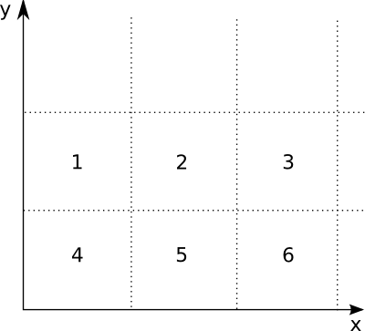

.. This is just a definition of |br| to be able to force a line break somewhere

.. |br| raw:: html

    

Configuration and running of a simulation
=========================================

The basic Simpact Cyan program is a standalone command-line program. To be able to
set up a simulation, you'd need to prepare a configuration file and specify this
file as a command-line argument. Preparing the configuration file manually is
time-consuming work, as all event properties necessary in a simulation need to
be set.
To make it easier to prepare and run simulations, there's a ``pysimpactcyan`` module
that you can use to control Simpact Cyan from Python, or alternatively there's
a ``RSimpactCyan`` library that you can install in R that provides a similar
interface. The Python module is included when you install the Simpact Cyan binaries,
the R library must be installed separately from an R session.

You can also use a combined approach: first run a simulation or simply prepare a
configuration file from R or Python, and subsequently use this configuration
to start one or more simulations. This can be very helpful to first prepare a
base configuration file in an easy way, and then to launch one or more simulations
on a computer cluster for example. For this particular case, it can be very
helpful to override e.g. a prefix on the output files as explained :ref:`below <configfile>`.

In this section, we briefly look into starting the simpact cyan program on the
command line, followed by explanations of how the :ref:`Python interface <startingfromPython>`
or :ref:`R interface <startingfromR>` works. Some insights into the :ref:`configuration file <configfile>`
are given next, since that is the actual input to the simulation. Typically, if
you can specify a particular probability distribution in the configuration file,
you can also specify others. At the end of this section we describe 
:ref:`which distributions <probdists>` are supported and what their parameters are.

.. _commandline:

Running from command line 
-------------------------

The Simpact Cyan executable that you're likely to need is called ``simpact-cyan-release``.
There is a version with debugging information as well: this performs exactly the same calculations, but
has more checks enabled. As a command line argument you can specify if the very basic
mNRM (in which all event times are recalculated after triggering an event) is to be
used, or the more advanced version (in which the program recalculates far less event
fire times). While ``simpact-cyan-release`` with the advanced mNRM algorithm is the
fastest, it may be a good idea to verify from time to time that the simple algorithm
yields the same results (when using the same random number generator seed), as well
as the debug versions.

The program needs three additional arguments, the first of which is the path to the
configuration file that specifies what should be simulated. The configuration file
is just a text file containing a list of key/value pairs, a part of which could 
look like this::

    ...
    population.nummen    = 200
    population.numwomen  = 200
    population.simtime   = 40
    ...

You can also define variables and use environment variables of your system, :ref:`later <configfile>`
we'll look into this config file in more detail. All configuration options and their
possible values are described in the section with the :ref:`simulation details <simdetails>`.
For the configuration file itself, *all* options that are needed in the simulation
*must* be set, no default values are assumed by the command line program. When using the
R or Python interface however, this helper system does know about default values
thereby severely limiting the number of options that must be specified. It will combine the
options you specify with the defaults to produce a full configuration file that the
command line program can use.

The second argument that the ``simpact-cyan-release`` program needs is either 0 or 1 and
specifies whether the single core version should be used (corresponds to ``0``), 
or the version using multiple cores (corresponds to ``1``). For the parallel version,
i.e. the version using multiple cores, `OpenMP <https://en.wikipedia.org/wiki/OpenMP>`_
is used as the underlying technology. By default the program will try to use all
processor cores your system has, but this can be adjusted by setting the
``OMP_NUM_THREADS`` environment variable.
In general, it is a good idea to specify ``0`` for this option, selecting the single-core
version. The parallel version currently only offers a modest speedup, and only for very
large population sizes. Especially if you need to do several runs of a simulation, starting
several single-core versions at once will use your computer's power more efficiently
than starting several parallel versions in a sequential way. 

With the third and final argument you can specify which mNRM algorithm to use: if you
specify 'simple', the basic mNRM is used in which all event fire times will be
recalculated after an event was triggered. Since this is a slow algorithm, you'll
probably want to specify 'opt' here, to use the more advanced algorithm. In this
case, the procedure explained above is used, where each user stores a list of
relevant events.

So, assuming we've created a configuration file called ``myconfig.txt`` that resides in
the current directory, we could run the corresponding simulation with the following
command::

    simpact-cyan-release myconfig.txt 0 opt

This will produce some output on screen, such as which version of the program is
being used and which random number generator seed was set. Since the random number
generator seed is in there, it may be a good idea to save this to a file in case
you'd like to reproduce the exact simulation later. To save it to a file called
``myoutput.txt``, you can run ::

    simpact-cyan-release myconfig.txt 0 opt 2>myoutput.txt

Note that it is not a redirection of the output using simply ``>``, but using ``2>``.
This has to do with the fact that the information that you see on screen is actually
sent to `stderr <https://en.wikipedia.org/wiki/Standard_streams>`_ instead of
``stdout``.

When running the Simpact Cyan program, the default behaviour is to initialize the
random number generator with a (more or less) random seed value. For reproducibility
it may be necessary to enforce a specific seed. To do so, set the environment variable
``MNRM_DEBUG_SEED`` to the value you want to use, and verify in the output of the
program that the specified seed is in fact the one being used:

 - for an MS-Windows system::

        set MNRM_DEBUG_SEED=12345
        simpact-cyan-release myconfig.txt 0 opt

   Note that value of ``MNRM_DEBUG_SEED`` is still set, which is important when running
   additional simulations. To clear it, either exit the current command prompt, or
   execute ::

        set MNRM_DEBUG_SEED=

   (nothing may be specified after the ``=`` sign, not even a space)

 - for a Linux or OS X system::

        export MNRM_DEBUG_SEED=12345
        simpact-cyan-release myconfig.txt 0 opt

   Note that value of ``MNRM_DEBUG_SEED`` is still set, which is important when running
   additional simulations. To clear it, either exit the current terminal window, or
   execute ::

        unset MNRM_DEBUG_SEED

   On one of these operating systems, it is also possible to specify everything in
   one line::

        MNRM_DEBUG_SEED=12345 simpact-cyan-release myconfig.txt 0 opt

   In this case, the value of ``MNRM_DEBUG_SEED`` will be visible to the program,
   but will no longer be set once the program finishes. It will therefore not
   affect other programs that are started.

.. _startingfromR:

Running from within R
---------------------

Getting started
^^^^^^^^^^^^^^^

.. include:: simpact_quick_r_steps.rst

The R interface to Simpact Cyan will underneath still execute one of the
Simpact Cyan programs, e.g. ``simpact-cyan-release``, so the :ref:`program <programs>`
relevant to your operating system must be installed first. Note that if
you're using MS-Windows, you'll also need to install the 
`Visual Studio 2015 redistributable package <https://www.microsoft.com/en-us/download/details.aspx?id=48145>`_
(use the **x86** version).

The R module actually contains Python code so to be able to use this, you'll
need to have a working Python installation. On Linux or OS X, this is usually
already available, but if you're using MS-Windows you may need to install this
separately. In this case, it is best to install it in the default directory,
e.g. ``C:\Python27`` or ``C:\Python34``, so that the R package will be able to
locate it easily.

Before being able to use the ``RSimpactCyan`` module, the library which
contains the R interface to the Simpact Cyan program, you need to make sure that other
libraries are available. The most straightforward way is to run ::

    source("https://raw.githubusercontent.com/j0r1/RSimpactCyanBootstrap/master/initsimpact.R")

which runs a script from `RSimpactCyanBootstrap <https://github.com/j0r1/RSimpactCyanBootstrap>`_ 
that downloads the required packages. 

If you prefer not to run a script this way you can also add, either temporarily 
in your current R session or more permanently in your ``.Rprofile`` file, the 
following lines which add the package repository containing the Simpact Cyan library::

    local({ x <- options()$repos
            if (!is.element("CRAN", x)) { 
                x["CRAN"] = "@CRAN@" 
            }
            x["SimpactCyan"] <- "http://research.edm.uhasselt.be/jori"
            options(repos = x) })

Then, you simply have to run ::

    install.packages("RSimpactCyan")

and packages on which ``RSimpactCyan`` depends will be downloaded and installed
automatically.

Without modifiying the list of repositories, you can also install the dependencies first
manually, followed by the ``RSimpactCyan`` library::

    install.packages("RJSONIO")
    install.packages("findpython")
    install.packages("rPithon", repos="http://research.edm.uhasselt.be/jori")
    install.packages("RSimpactCyan", repos="http://research.edm.uhasselt.be/jori")

Finally, you can load the library with the command::

    library("RSimpactCyan")

Running a simulation
^^^^^^^^^^^^^^^^^^^^

To configure a simulation, you need to specify the options for which you want
to use a value other than the default. This is done using a list, for example ::

    cfg <- list()
    cfg["population.nummen"] <- 200
    cfg["population.numwomen"] <- 200
    cfg["population.simtime"] <- 40

All values that are entered this way are converted to character strings when
creating a configuration file for the simulation. This means that instead of
a numeric value, you could also use a string that corresponds to the same
number, for example ::

    cfg["population.nummen"] <- "200"

Together with the defaults for other options, these settings will be combined into
a configuration file that the real Simpact Cyan program can understand. Taking
a look at the full configuration file will show you what other values are in use;
to see this configuration file, run ::

    simpact.showconfig(cfg)

Lines that start with a ``#`` sign are ignored when the configuration file is read.
They may contain comments about certain options, or show which options are not
in use currently. In case you'd want to use a simulation using all defaults, you can either use an
empty list, or specify ``NULL``. 

If you've got the configuration you'd like to use,
you can start the simulation from within R with the command ``simpact.run``. Two
parameters *must* be specified: the first is the settings to use (the ``cfg`` list
in our example) and the second is a directory where generated files and results
can be stored. The R module will attempt to create this directory if it does not
exist yet. To use the directory ``/tmp/simpacttest``, the command would become ::

    res <- simpact.run(cfg, "/tmp/simpacttest")

The other parameters are:

 - ``agedist``: With this parameter, you can specify the age distribution that should be used
   when generating an initial population. The default is the age distribution of
   South Africa from 2003. In R, you can specify an alternative age distribution
   in two ways. 

   The first way to do this, is to specify the age distribution as an R data frame
   or list, which contains columns named ``Age``, ``Percent.Male`` and ``Percent.Female``.
   The ``Age`` column should be increasing, and the other columns specify the
   probability of selecting each gender between the corresponding age and the next. Before
   the first specified age, this probability is zero, and the last mentioned
   age should have zeroes as the corresponding probabilities. The term probability
   here is not strictly correct: it can be any positive number since the resulting
   distribution will be normed. As an example ::

        ad <- list(Age=c(0,50,100), Percent.Male=c(1,2,0), Percent.Female=c(2,1,0))

   will correspond to an age distribution which limits the age to 100 for everyone.
   Furthermore, there will be twice as many men over 50 than under 50, while for the
   women it's the other way around.

   The other way an age distribution can be specified, is as a CSV file with (at
   least) three columns. The header of this CSV file will not be taken into account,
   instead the first column is assumed to hold the ``Age`` column, the second is
   interpreted as the ``Percent.Male`` column and the third as ``Percent.Female``.

 - ``intervention``: With this simulation intervention setting it is possible to change configuration
   options that are being used at specific times during the simulation. More information
   about how this can be used can be found in the explanation of the 
   :ref:`simulation intervention event <simulationintervention>`.

 - ``release``, ``slowalg``, ``parallel``: These flags specify which precise version of the
   simulation program will be used, and whether the single-core or multi-core version
   is used. The ``release`` parameter is ``TRUE`` by default, yielding the fastest version
   of the selected algorithm. If set to ``FALSE``, many extra checks are performed, all
   of which should pass if the algorithm works as expected.
   
   By default, ``slowalg`` is ``FALSE`` which selects the population-based
   procedure described above. In case this is set to ``TRUE``, the very basic mNRM algorithm is
   used, where all event fire times are recalculated after each event is executed.
   If all works as expected, the two algorithms should produce the same results for
   the same seed (although very small differences are possible due to limited
   numeric precision). The basic algorithm is very slow, keep this in mind if you
   use it.

   The ``parallel`` parameter is ``FALSE`` by default, selecting the version of the
   algorithm that only uses a single processor core. To use the parallel version,
   i.e. to use several processor cores at the same time, this can be set to ``TRUE``.
   The parallel version currently only offers a modest speedup, and only for very
   large population sizes. Especially if you need to do several runs of a simulation, starting
   several single-core versions at once will use your computer's power more efficiently
   than starting several parallel versions in a sequential way. 

 - ``seed``: By default, a more or less random seed value will be used to initialize
   the random number generator that's being using in the simulation. In case you'd like
   to use a specific value for the seed, for example to reproduce results found earlier,
   you can set it here.

 - ``dryrun``: If this is set to ``TRUE``, the necessary configuration files will be
   generated, but the actual simulation is *not* performed. This can come in handy
   to prepare a simulation's settings on your local machine and run one or more
   actual simulations on another machine, e.g. on a computer cluster. In case you'd
   like to perform several runs with the same configuration file, overriding the
   output prefix can be very helpful, as is described in the section on the
   :ref:`configuration file <configfile>`. If you'd like to perform a run that has been
   prepared this way from within R, you can use the ``simpact.run.direct`` function.

 - ``identifierFormat``: Files that are created by the simulation will all start with the 
   same identifier. The identifierFormat parameter specifies what this identifier should be. 
   Special properties start with a percent (``%``) sign, other things are just copied. An 
   overview of these special properties:

    - ``%T``: will expand to the simulation type, e.g. ``simpact-cyan``
    - ``%y``: the current year
    - ``%m``: the current month (number)
    - ``%d``: the current day of the month
    - ``%H``: the current hour
    - ``%M``: the current minute
    - ``%S``: the current second
    - ``%p``: the process ID of the process starting the simulation
    - ``%r``: a random character
    
   The default identifier format ``%T-%y-%m-%d-%H-%M-%S_%p_%r%r%r%r%r%r%r%r-`` would lead to 
   an identifier like ``simpact-cyan-2015-01-15-08-28-10_2425_q85z7m1G-``.

 - ``dataFiles``: if specified, this should be a list where each named entry contains a 
   matrix. These matrices will be written to CSV files, which can be referred to in the
   configuration entries. For example, we could to something like this::

        myMatrix <- matrix(c(1,2,3,4),2,2)
        data <- list()
        data[["csvMatrix"]] <- myMatrix

   To refer to this csv file in the configuration settings, we can use the ``data:``
   prefix, e.g. ::

        cfg <- list()
        cfg["person.geo.dist2d.type"] <- "discrete"
        cfg["person.geo.dist2d.discrete.densfile"] <- "data:csvMatrix"

   The simulation would then be started as follows::

        simpact.run(cfg, "/tmp/simpacttest", dataFiles=data)

The return value of the ``simpact.run`` function contains the paths to generated files
and output files, or in case the ``dryrun`` option was used, of files that will be written
to. The :ref:`output files <outputfiles>` that are produced are described in the corresponding
section.

Other functions
^^^^^^^^^^^^^^^

Apart from ``simpact.showconfig`` and ``simpact.run``, some other functions exist in the
``RSimpactCyan`` library as well:

 - ``simpact.available`` |br|
   This function returns a boolean value, that indicates if the ``RSimpactCyan`` library
   is able to find and use the Simpact Cyan simulation :ref:`program <programs>`.

 - ``simpact.getconfig`` |br|
   This takes a list with config values as input, similar to ``simpact.showconfig``,
   merges it with default settings, and returns the extended configuration list.
   If the second parameter (``show``) is set to ``TRUE``, then the full configuration
   file will be shown on-screen as well.
  
 - ``simpact.run.direct`` |br|
   This function allows you to start a simulation based on a previously created
   (e.g. using the ``dryrun`` setting of ``simpact.run``) configuration file. This
   config file must be set as the first argument, and is always required. Other
   arguments are optional:

    - ``outputFile``: If set to ``NULL``, the output of the Simpact Cyan simulation
      (containing information about the version of the program and the random
      number generator seed) will just appear on screen. If a filename is
      specified here, the output will be written to that file as well.
    - ``release``, ``slowalg``, ``parallel``, ``seed``: Same meaning as in the ``simpact.run``
      function
    - ``destDir``: By default, the simulation will be run in the directory that
      contains the config file. This is important if the config file itself
      specifies files without an *absolute* path name since the directory
      of the config file will then be used as a starting point. If you don't
      want this behaviour and need to select another directory, this parameter
      can be used to set it.

 - ``simpact.set.datadir`` |br|
   The ``RSimpactCyan`` library will try to figure out where the Simpact Cyan
   data files are located. If you want to specify another location, this
   function can be used to do so.

 - ``simpact.set.simulation`` |br|
   The Simpact Cyan package is actually meant to support alternative simulations
   as well. To use such an alternative simulation, this function can be used.
   For example, if ``maxart`` is specified here, instead of running e.g.
   ``simpact-cyan-release`` as underlying program, ``maxart-release`` would be executed
   instead.

.. _startingfromPython:

Running from within Python
--------------------------

Getting started
^^^^^^^^^^^^^^^

The ``pysimpactcyan`` module to control Simpact Cyan from within Python, is 
automatically available once you've installed the :ref:`program <programs>`. Note that if
you're using MS-Windows, you'll also need to install the 
`Visual Studio 2015 redistributable package <https://www.microsoft.com/en-us/download/details.aspx?id=48145>`_
(use the **x86** version).
To load the Simpact Cyan module in a Python script or interactive session, just execute ::

    import pysimpactcyan

This allows you to create an instance of the ``PySimpactCyan`` class that's defined in this
module, let's call it ``simpact``::

    simpact = pysimpactcyan.PySimpactCyan()

Running a simulation
^^^^^^^^^^^^^^^^^^^^

To configure a simulation, you need to specify the options for which you want
to use a value other than the default. This is done using a dictionary, for example ::

    cfg = { }
    cfg["population.nummen"] = 200
    cfg["population.numwomen"] = 200
    cfg["population.simtime"] = 40

All values that are entered this way are converted to character strings when
creating a configuration file for the simulation. This means that instead of
a numeric value, you could also use a string that corresponds to the same
number, for example ::

    cfg["population.nummen"] = "200"

Together with the defaults for other options, these settings will be combined into
a configuration file that the real Simpact Cyan program can understand. Taking
a look at the full configuration file will show you what other values are in use;
to see this configuration file, run ::

    simpact.showConfiguration(cfg)

Lines that start with a ``#`` sign are ignored when the configuration file is read.
They may contain comments about certain options, or show which options are not
in use currently. In case you'd want to use a simulation using all defaults, you can either use an
empty dictionary, or specify ``None``. 

If you've got the configuration you'd like to use,
you can start the simulation from within Python using the ``run`` method of the
Simpact Cyan object you're using. Two
parameters *must* be specified: the first is the settings to use (the ``cfg`` dictionary
in our example) and the second is a directory where generated files and results
can be stored. The Python module will attempt to create this directory if it does not
exist yet. To use the directory ``/tmp/simpacttest``, the command would become ::

    res = simpact.run(cfg, "/tmp/simpacttest")

The other parameters are:

 - ``agedist``: With this parameter, you can specify the age distribution that should be used
   when generating an initial population. The default is the age distribution of
   South Africa from 2003. In Python, you can specify an alternative age distribution
   in two ways. 

   The first way to do this, is to specify the age distribution as a dictionary
   which contains lists of numbers named ``Age``, ``Percent.Male`` and ``Percent.Female``.
   The ``Age`` list should be increasing, and the other lists specify the
   probability of selecting each gender between the corresponding age and the next. Before
   the first specified age, this probability is zero, and the last mentioned
   age should have zeroes as the corresponding probabilities. The term probability
   here is not strictly correct: it can be any positive number since the resulting
   distribution will be normed. As an example ::

        ad = { "Age": [0, 50, 100], "Percent.Male": [1, 2, 0], "Percent.Female": [2, 1, 0] }

   will correspond to an age distribution which limits the age to 100 for everyone.
   Furthermore, there will be twice as many men over 50 than under 50, while for the
   women it's the other way around.

   The other way an age distribution can be specified, is as a CSV file with (at
   least) three columns. The header of this CSV file will not be taken into account,
   instead the first column is assumed to hold the ``Age`` column, the second is
   interpreted as the ``Percent.Male`` column and the third as ``Percent.Female``.

 - ``parallel``, ``opt``, ``release``: These flags specify which precise version of the
   simulation program will be used, and whether the single-core or multi-core version
   is used. The ``release`` parameter is ``True`` by default, yielding the fastest version
   of the selected algorithm. If set to ``False``, many extra checks are performed, all
   of which should pass if the algorithm works as expected.
   
   By default, ``opt`` is ``True`` which selects the population-based
   procedure described above. In case this is set to ``False``, the very basic mNRM algorithm is
   used, where all event fire times are recalculated after each event is executed.
   If all works as expected, the two algorithms should produce the same results for
   the same seed (although very small differences are possible due to limited
   numeric precision). The basic algorithm is very slow, keep this in mind if you
   use it.

   The ``parallel`` parameter is ``False`` by default, selecting the version of the
   algorithm that only uses a single processor core. To use the parallel version,
   i.e. to use several processor cores at the same time, this can be set to ``True``.
   The parallel version currently only offers a modest speedup, and only for very
   large population sizes. Especially if you need to do several runs of a simulation, starting
   several single-core versions at once will use your computer's power more efficiently
   than starting several parallel versions in a sequential way. 

 - ``seed``: By default, a more or less random seed value will be used to initialize
   the random number generator that's being using in the simulation. In case you'd like
   to use a specific value for the seed, for example to reproduce results found earlier,
   you can set it here.

 - ``interventionConfig``: With this simulation intervention setting it is possible to change configuration
   options that are being used at specific times during the simulation. More information
   about how this can be used can be found in the explanation of the 
   :ref:`simulation intervention event <simulationintervention>`.

 - ``dryRun``: If this is set to ``True``, the necessary configuration files will be
   generated, but the actual simulation is _not_ performed. This can come in handy
   to prepare a simulation's settings on your local machine and run one or more
   actual simulations on another machine, e.g. on a computer cluster. In case you'd
   like to perform several runs with the same configuration file, overriding the
   output prefix can be very helpful, as is described in the section on the
   :ref:`configuration file <configfile>`. If you'd like to perform a run that has been
   prepared this way from within Python, you can use the ``runDirect`` method of
   the ``PySimpactCyan`` class.

 - ``identifierFormat``: Files that are created by the simulation will all start with the 
   same identifier. The identifierFormat parameter specifies what this identifier should be. 
   Special properties start with a percent (``%``) sign, other things are just copied. An 
   overview of these special properties:

    - ``%T``: will expand to the simulation type, e.g. ``simpact-cyan``
    - ``%y``: the current year
    - ``%m``: the current month (number)
    - ``%d``: the current day of the month
    - ``%H``: the current hour
    - ``%M``: the current minute
    - ``%S``: the current second
    - ``%p``: the process ID of the process starting the simulation
    - ``%r``: a random character
    
   The default identifier format ``%T-%y-%m-%d-%H-%M-%S_%p_%r%r%r%r%r%r%r%r-`` would lead to 
   an identifier like ``simpact-cyan-2015-01-15-08-28-10_2425_q85z7m1G-``.

 - ``dataFiles``: if specified, this should be a dictionary where each named entry contains a 
   an array of arrays or a Pandas DataFrame. These matrices will be written to CSV files, 
   which can be referred to in the configuration entries. For example, we could to 
   something like this::

        myMatrix = [ [1, 3], [2, 4] ]
        data = { }
        data["csvMatrix"] = myMatrix

   To refer to this csv file in the configuration settings, we can use the ``data:``
   prefix, e.g. ::

        cfg = { }
        cfg["person.geo.dist2d.type"] = "discrete"
        cfg["person.geo.dist2d.discrete.densfile"] = "data:csvMatrix"

   The simulation would then be started as follows::

        simpact.run(cfg, "/tmp/simpacttest", dataFiles=data)

The return value of the ``run`` method contains the paths to generated files
and output files, or in case the ``dryRun`` option was used, of files that will be written
to. The :ref:`output files <outputfiles>` that are produced are described in the corresponding
section.

Other functions
^^^^^^^^^^^^^^^

Apart from the  ``PySimpactCyan`` methods ``showConfiguration`` and ``run``, some other methods
exist in this Python class as well:

 - ``getConfiguration`` |br|
   This takes a dictionary with config values as input, similar to ``showConfiguration``,
   merges it with default settings, and returns the extended configuration dictionary.
   If the second parameter (``show``) is set to ``True``, then the full configuration
   file will be shown on-screen as well.
  
 - ``runDirect`` |br|
   This function allows you to start a simulation based on a previously created
   (e.g. using the ``dryRun`` setting of ``run``) configuration file. This
   config file must be set as the first argument, and is always required. Other
   arguments are optional:

    - ``outputFile``: If set to ``None``, the output of the Simpact Cyan simulation
      (containing information about the version of the program and the random
      number generator seed) will just appear on screen. If a filename is
      specified here, the output will be written to that file as well.
    - ``release``, ``opt``, ``parallel``, ``seed``: Same meaning as in the ``run``
      method.
    - ``destDir``: By default, the simulation will be run in the directory that
      contains the config file. This is important if the config file itself
      specifies files without an *absolute* path name since the directory
      of the config file will then be used as a starting point. If you don't
      want this behaviour and need to select another directory, this parameter
      can be used to set it.

 - ``setSimpactDataDirectory`` |br|
   The ``pysimpactcyan`` module will try to figure out where the Simpact Cyan
   data files are located. If you want to specify another location, this
   function can be used to do so.

 - ``setSimpactDirectory`` |br|
   In case you want to specify that the Simpact Cyan executables are located
   in a specific directory, you can use this function.

 - ``setSimulationPrefix`` |br|
   The Simpact Cyan package is actually meant to support alternative simulations
   as well. To use such an alternative simulation, this function can be used.
   For example, if ``maxart`` is specified here, instead of running e.g.
   ``simpact-cyan-release`` as underlying program, ``maxart-release`` would be executed
   instead.

.. _configfile:

Configuration file and variables
--------------------------------

The actual program that executes the simulation reads its settings from a certain
configuration file. This is also the case when running from R or Python, where
the R or Python interface prepares the configuration file and executes the
simulation program. While this approach makes it much easier to configure and
run simulations, some knowledge of the way the configuration file works can
be helpful.

The basics
^^^^^^^^^^

In essence, the configuration file is just a text file containing key/value pairs.
For example, the line ::

    population.simtime = 100

assigns the value 100 to the simulation setting ``population.simtime``, indicating
that the simulation should run for 100 years. Lines that start with a hash sign (``#``)
are not processed, they can be used for comments. In the config file itself, mathematical
operations are not possible, but if you're using R or Python, you can perform the
operation there, and only let the result appear in the config file. For example, if
you'd do ::

    library("RSimpactCyan")
    cfg <- list()
    cfg["population.simtime"] = 100/4
    simpact.showconfig(cfg)

in an R session, you'd find ::

    population.simtime = 25

in the configuration file. We could force '100/4' to appear in the configuration file by
changing the line to ::

    cfg["population.simtime"] = "100/4"

(so we added quotes), but when trying to run the simulation this would lead to the
following error::

    FATAL ERROR:
    Can't interpret value for key 'population.simtime' as a floating point number

Config file variables and environment variables
^^^^^^^^^^^^^^^^^^^^^^^^^^^^^^^^^^^^^^^^^^^^^^^

Keys that start with a dollar sign (``$``) are treated in a special way: they define
a variable that can be used further on in the configuration file. To use a variable's
contents in the value part of a config line, the variable's name
should be placed between ``${`` and ``}``. For example, we could first have set ::

    $SIMTIME = 100

thereby assigning ``100`` to the variable with name ``SIMTIME``. This could then later be 
used as follows::

    population.simtime = ${SIMTIME}

You don't even need to define the variable inside the configuration file: if you
define an environment variable, you can use its contents in the same way as before.
For example, if the ``HOME`` environment variable has been set to ``/Users/JohnDoe/``,
then the lines ::

    periodiclogging.interval            = 2
    periodiclogging.outfile.logperiodic = ${HOME}periodiclog.csv

would enable the :ref:`periodic logging event <periodiclogging>` and write its output
every other year to ``/Users/JohnDoe/periodiclog.csv``.

One very important thing to remember is that if an environment variable with the same
name as a config file variable exists, **the environment variable will always take
precedence over config file variables**. While this might seem a bit odd, it actually
allows you to more easily use config files prepared on one system, on another system.
Furthermore, it allows you to use a single config file multiple times, which can be
very handy if you need to perform many runs using the same settings (but different
output files).

Using environment variables
^^^^^^^^^^^^^^^^^^^^^^^^^^^

When you let the R or Python interface prepare a configuration file, this file
will start by defining two config file variables, for example::

    $SIMPACT_OUTPUT_PREFIX = simpact-cyan-2015-05-27-08-28-13_27090_8Al7O6mD-
    $SIMPACT_DATA_DIR = /usr/local/share/simpact-cyan/

The first variable is used in the config file when specifying which files to
write output to. As an example, you'd also find the line ::

    logsystem.outfile.logevents = ${SIMPACT_OUTPUT_PREFIX}eventlog.csv

in that file, so the full output file name would be ::

    simpact-cyan-2015-05-27-08-28-13_27090_8Al7O6mD-eventlog.csv

The second variable specifies the location that R or Python thinks
the Simpact Cyan data files are stored in, and is used in the line that specifies
which age distribution to use when initializing the population::

    population.agedistfile = ${SIMPACT_DATA_DIR}sa_2003.csv

In this case, the file ``/usr/local/share/simpact-cyan/sa_2003.csv`` would be
used to read the initial age distribution from.

Because those config variables are defined inside the configuration file, such
a file can be used on its own. If you'd first prepared the config file using the
'dryrun' setting, you could still use the created config file to start the 
simulation, either directly on the command line, using ``simpact.run.direct`` from R,
or using the ``PySimpactCyan`` method ``runDirect`` in Python.

If you're running from the :ref:`command line <commandline>`, it's very easy
to reuse the same configuration file for multiple runs. Normally if you'd
try this, you'd see an error message like ::

    FATAL ERROR:
    Unable to open event log file: 
    Specified log file simpact-cyan-2015-05-27-08-28-13_27090_8Al7O6mD-eventlog.csv already exists

To make sure that you don't lose data from simulations you've already performed,
the simulation will not start if it needs to overwrite an output file, which is
what causes this message. 

However, because we can easily override the value of
``SIMPACT_OUTPUT_PREFIX`` from the command line by using an environment variable
with the same name, it becomes possible to reuse the configuration file multiple
times. For example, assuming that our config file is called ``myconfig.txt``, 
the simple `bash <https://en.wikipedia.org/wiki/Bash_(Unix_shell)>`_ script ::

    for i in 1 2 3 4 5 ; do
        SIMPACT_OUTPUT_PREFIX=newprefix_${i}- simpact-cyan-release myconfig.txt 0 opt
    done

would produce output files like ``newprefix_1-eventlog.csv`` and ``newprefix_5-eventlog.csv``.

In a similar way, setting an environment variable called ``SIMPACT_DATA_DIR``
can be helpful when preparing simulations on one system and running them on
another. For example, you could prepare the simulations on your laptop, using the
'dryrun' option to prevent the simulation from actually running, and execute
them on e.g. a computer cluster where you set the ``SIMPACT_DATA_DIR`` environment
variable to make sure that the necessary data files can still be found.

.. _probdists:

Supported probability distributions and their parameters
--------------------------------------------------------

If a configuration option ends with ``.dist.type`` or ``.dist2d.type``, for example
option ``birth.pregnancyduration.dist.type`` of the :ref:`birth event <birth>`, you can
specify a number of probability distributions there. By choosing a specific
type of probability distribution, you also activate a number of other options
to configure the parameters of this probability distribution.

For example, if ``birth.pregnancyduration.dist.type`` is set to ``normal``, then
parameters of the :ref:`one dimensional normal distribution <normal1d>` need to be
configured. For example, we could set ``birth.pregnancyduration.dist.normal.mu``
to 0.7342 and ``birth.pregnancyduration.normal.sigma`` to 0.0191, and we'd get
a birth event that on average takes place after 0.7342 years (is 268 days),
with a standard deviation of roughly one week (0.0191 years).

Below you can find an overview of the currently supported :ref:`one <prob1d>` and
:ref:`two dimensional <prob2d>` distributions and their parameters.

.. _prob1d:

One dimensional distributions
^^^^^^^^^^^^^^^^^^^^^^^^^^^^^

Here is an overview of the relevant configuration options, their defaults (between
parentheses), and their meaning:

 - ``some.option.dist.type``: ('fixed'): |br|
   With such an option, you specify which specific distribution to choose. Allowed
   values are ``beta``, ``discrete.csv.onecol``, ``discrete.csv.twocol``, ``discrete.inline``,
   ``exponential``, ``fixed``, ``gamma``, ``lognormal``, ``normal``, ``uniform``,
   and the corresponding parameters are given in the subsections below. Unless otherwise
   specified, the default here is a ``fixed`` distribution, which is not really a
   distribution but just causes a fixed value to be used. 

``beta``
""""""""

If this distribution is chosen, the (scaled) beta distribution with the following
probability density is used:

.. math::

    {\rm prob}(x) = \frac{\Gamma(a+b)}{\Gamma(a)\Gamma(b)} \left(\frac{x-x_{\rm min}}{x_{\rm max}-x_{\rm min}}\right)^{a-1}
                   \left(1-\frac{x-x_{\rm min}}{x_{\rm max}-x_{\rm min}}\right)^{b-1} \frac{1}{x_{\rm max}-x_{\rm min}}

This corresponds to a `beta distribution <https://en.wikipedia.org/wiki/Beta_distribution>`_ that,
instead of being non-zero between 0 and 1, is now scaled and translated to be defined between
:math:`x_{\rm min}` and :math:`x_{\rm max}`.

Here is an overview of the relevant configuration options, their defaults (between
parentheses), and their meaning:

 - ``some.option.dist.beta.a`` (no default): |br| 
   Corresponds to the value of :math:`a` in the formula for the probability density above.
 - ``some.option.dist.beta.b`` (no default): |br| 
   Corresponds to the value of :math:`b` in the formula for the probability density above.
 - ``some.option.dist.beta.max`` (no default): |br| 
   Corresponds to the value of :math:`x_{\rm min}` in the formula for the probability density above.
 - ``some.option.dist.beta.min`` (no default): |br| 
   Corresponds to the value of :math:`x_{\rm max}` in the formula for the probability density above.

discrete.csv.onecol
"""""""""""""""""""

This distribution allows you to draw random numbers based on the values in a
single column (``ycolumn``) of a CSV file (``file``). The distribution will return
values between ``xmin`` and ``xmax``, with probabilities according to the entries
in the column of the CSV file. If ``floor`` is set to ``no``, then any value that
lies within the bin is possible; if ``yes``, then only start values of each bin
can be returned.

For example, suppose we have a CSV file that corresponds to this table:

+------+
| Prob |
+======+
|   10 |
+------+
|   30 |
+------+

If we specify ``xmin`` to be 0 and ``xmax`` to be 2, then there's 25% chance that
the generated random number will lie between 0 and 1, and 75% chance that
it will lie between 1 and 2. If we set ``floor`` to ``yes``, then 25% of the generated
random numbers will be 0, while 75% will be 1.

Here is an overview of the relevant configuration options, their defaults (between
parentheses), and their meaning:

 - ``some.option.dist.discrete.csv.onecol.file`` (no default): |br|
   This is the filename of the CSV file containing the column to use for the
   probability density.
 - ``some.option.dist.discrete.csv.onecol.floor`` ('no'): |br|
   By default, any value within a bin is allowed. If set to ``yes``, then only
   the bin start values can be generated.
 - ``some.option.dist.discrete.csv.onecol.xmin`` (0): |br|
   The minimum value that's possibly generated by the distribution. Maps to
   the start of the CSV column.
 - ``some.option.dist.discrete.csv.onecol.xmax`` (1): |br|
   The maximum value that's possibly generated by the distribution. Maps to
   the end of the CSV column.
 - ``some.option.dist.discrete.csv.onecol.ycolumn`` (1): |br|
   The number of the column to use from the CSV file.

discrete.csv.twocol
"""""""""""""""""""

This distribution allows you to generate random numbers based on the values
in two columns (``xcolumn`` and ``ycolumn``) of a CSV file (``file``). The ``xcolumn``
of the CSV file specifies the start of each bin, the ``ycolumn`` corresponds to
the probability of generating a random number in that bin. To be able to
determine when the last bin ends, the last entry in the ``ycolumn`` must be
zero. If ``floor`` is set to ``no``, then any value that
lies within the bin is possible; if ``yes``, then only start values of each bin
can be returned.

For example, support we have a CSV file that corresponds to the table below,
and we've set ``xcolumn`` to 1 and ``ycolumn`` to 2. In this case, 25% of the
generated random numbers will have a value between 0 and 3, while 75% of the
random numbers will lie between 3 and 4. If ``floor`` is set to ``yes``, then 25%
of the random numbers will be 0, and 75% will be 3.

+---+------+
| X | Prob |
+===+======+
| 0 |   10 |
+---+------+
| 3 |   30 |
+---+------+
| 4 |    0 |
+---+------+

Here is an overview of the relevant configuration options, their defaults (between
parentheses), and their meaning:

 - ``some.option.dist.discrete.csv.twocol.file`` (no default): |br|
   This is the filename of the CSV file containing the columns to use for the
   probability density.
 - ``some.option.dist.discrete.csv.twocol.floor`` ('no'): |br|
   By default, any value within a bin is allowed. If set to ``yes``, then only
   the bin start values can be generated.
 - ``some.option.dist.discrete.csv.twocol.xcolumn`` (1): |br|
   The number of the column to use from the CSV file that contains the bin
   start values.
 - ``some.option.dist.discrete.csv.twocol.ycolumn`` (2): |br|
   The number of the column to use from the CSV file that contains the probabilities.

``discrete.inline``
"""""""""""""""""""

This distribution allows you to generate random numbers based on the values
in two lists (``xvalues`` and ``yvalues``). The ``xvalues`` list specifies the start 
of each bin, the ``yvalues`` entries correspond to the probability of generating 
a random number in that bin. To be able to
determine when the last bin ends, the last entry in ``yvalues`` must be
zero. If ``floor`` is set to ``no``, then any value that
lies within the bin is possible; if ``yes``, then only start values of each bin
can be returned.

For example, support we have a the following settings::

    xvalues = 0,3,4
    yvalues = 10,30,0

In this case, 25% of the generated random numbers will have a value between 0 and 3, 
while 75% of the random numbers will lie between 3 and 4. If ``floor`` is set to ``yes``, 
then 25% of the random numbers will be 0, and 75% will be 3.

Here is an overview of the relevant configuration options, their defaults (between
parentheses), and their meaning:

 - ``some.option.dist.discrete.inline.floor`` ('no'): |br|
   By default, any value within a bin is allowed. If set to ``yes``, then only
   the bin start values can be generated.
 - ``some.option.dist.discrete.inline.xvalues`` (no default): |br|
   A list of increasing values corresponding to the bin start values.
 - ``some.option.dist.discrete.inline.yvalues`` (no default): |br|
   A list of equal length as ``xvalues``, specifying the probability of
   generating a random number in the corresponding bin. The last value
   must be zero.

``exponential``
"""""""""""""""

If the exponential distribution is selected, the probability density for a negative value is
zero, while the probability density for positive values is given by:

.. math::

    {\rm prob}(x) = \lambda \exp(-\lambda x)

Here is an overview of the relevant configuration options, their defaults (between
parentheses), and their meaning:

 - ``some.option.dist.exponential.lambda`` (no default): |br|
   This specifies the value of :math:`\lambda` in the expression of the probability density
   above.

``fixed``
"""""""""

This does not really correspond to a distribution, instead a predefined value is
always used.

Here is an overview of the relevant configuration options, their defaults (between
parentheses), and their meaning:

 - ``some.option.dist.fixed.value`` (0): |br|
   When a number is chosen from this 'distribution', this value is always returned.

``gamma``
"""""""""

In this case, the `gamma distribution <https://en.wikipedia.org/wiki/Gamma_distribution>`_
will be used to choose random numbers. The probability density is

.. math::

    {\rm prob}(x) = \frac{x^{a-1} \exp\left(-\frac{x}{b}\right)}{b^a \Gamma(a)}

for positive numbers, and zero for negative ones.

Here is an overview of the relevant configuration options, their defaults (between
parentheses), and their meaning:

 - ``some.option.dist.gamma.a`` (no default): |br|
   This corresponds to the value of :math:`a` in the expression of the probability
   distribution.
 - ``some.option.dist.gamma.b`` (no default): |br|
   This corresponds to the value of :math:`b` in the expression of the probability
   distribution.

``lognormal``
"""""""""""""

If this `log-normal distribution <https://en.wikipedia.org/wiki/Log-normal_distribution>`_
is chosen, the probability density for negative numbers is zero,
while for positive numbers it is:

.. math::

    {\rm prob}(x) = \frac{1}{x \sigma \sqrt{2\pi}} \exp\left(-\frac{(\log{x}-\zeta)^2}{2\sigma^2}\right)

Here is an overview of the relevant configuration options, their defaults (between
parentheses), and their meaning:

 - ``some.option.dist.lognormal.sigma`` (no default): |br|
   This corresponds to the value of :math:`\sigma` in the formula for the probability
   distribution.
 - ``some.option.dist.lognormal.zeta`` (no default): |br|
   This corresponds to the value of :math:`\zeta` in the formula for the probability
   distribution.

.. _normal1d:

``normal``
""""""""""

The base probability distribution used when the `normal distribution <https://en.wikipedia.org/wiki/Normal_distribution>`_
is selected is the following:

.. math::

    {\rm prob}(x) = \frac{1}{\sigma\sqrt{2\pi}} \exp\left(- \frac{(x-\mu)^2}{2\sigma^2}\right)

It is possible to specify a minimum and maximum value as well, which causes the probability
density to be zero outside of these bounds, and somewhat higher in between. A very straightforward
`rejection sampling <https://en.wikipedia.org/wiki/Rejection_sampling>`_ method is used for
this at the moment, so it is best not to use this to sample from a narrow interval (or
in general an interval with a low probability) since this can require many iterations.

Here is an overview of the relevant configuration options, their defaults (between
parentheses), and their meaning:

 - ``some.option.dist.normal.max`` (+infinity): |br|
   This can be used to specify the maximum value beyond which the probability density
   is zero. By default no truncation is used, and this maximum is set to positive
   infinity.
 - ``some.option.dist.normal.min`` (-infinity): |br|
   This can be used to specify the minimum value below which the probability density
   is zero. By default no trunctation is used, and this minimum is set to negative
   infinity.
 - ``some.option.dist.normal.mu`` (no default): |br|
   This corresponds to the value of :math:`\mu` in the expression of the probability
   density above.
 - ``some.option.dist.normal.sigma`` (no default): |br|
   This corresponds to the value of :math:`\sigma` in the expression of the probability
   density above.

``uniform``
"""""""""""

When this probability density is selected, each number has an equal probability
density between a certain minimum and maximum value. Outside of these bounds,
the probability density is zero.

Here is an overview of the relevant configuration options, their defaults (between
parentheses), and their meaning:

 - ``some.option.dist.uniform.min`` (0): |br|
   This specifies the start of the interval with the same, constant probability
   density.
 - ``some.option.dist.uniform.max`` (1): |br|
   This specifies the end of the interval with the same, constant probability
   density.

.. _prob2d:

Two dimensional distributions
^^^^^^^^^^^^^^^^^^^^^^^^^^^^^

Here is an overview of the relevant configuration options, their defaults (between
parentheses), and their meaning:

 - ``some.option.dist2d.type`` ('fixed'): |br|
   ``binormal``, ``binormalsymm``, ``discrete``, ``fixed``, ``uniform``

``binormal``
""""""""""""

This corresponds to the two dimensional `multivariate normal distribution <https://en.wikipedia.org/wiki/Multivariate_normal_distribution>`_,
which has the following probability density:

.. math::

    {\rm prob}(x,y) = \frac{1}{2\pi\sigma_x\sigma_y\sqrt{1-\rho^2}}
                     \exp\left[-\frac{
                                 \frac{(x-\mu_x)^2}{\sigma_x^2}
                               + \frac{(y-\mu_y)^2}{\sigma_y^2}
                               - \frac{2\rho (x-\mu_x)(y-\mu_y)}{\sigma_x\sigma_y}
                               }{2(1-\rho^2)}
                     \right]

If desired, this probability density can be truncated to specific bounds, by
setting the ``minx``, ``maxx``, ``miny`` and ``maxy`` parameters. These default to
negative and positive infinity causing truncation to be disabled. To enforce
these bounds a straightforward `rejection sampling <https://en.wikipedia.org/wiki/Rejection_sampling>`_
method is used, so to avoid a large number of iterations to find a valid
random number, it is best not to restrict the acceptable region to one with
a low probability.

Here is an overview of the relevant configuration options, their defaults (between
parentheses), and their meaning:

 - ``some.option.dist2d.binormal.meanx`` (0): |br|
   Corresponds to :math:`\mu_x` in the expression for the probability density above.
 - ``some.option.dist2d.binormal.meany`` (0): |br|
   Corresponds to :math:`\mu_y` in the expression for the probability density above.
 - ``some.option.dist2d.binormal.rho`` (0): |br|
   Corresponds to :math:`\rho` in the expression for the probability density above.
 - ``some.option.dist2d.binormal.sigmax`` (1): |br|
   Corresponds to :math:`\sigma_x` in the expression for the probability density above.
 - ``some.option.dist2d.binormal.sigmay`` (1): |br|
   Corresponds to :math:`\sigma_y` in the expression for the probability density above.
 - ``some.option.dist2d.binormal.minx`` (-infinity): |br|
   This can be used to truncate the probability distribution in the x-direction.
 - ``some.option.dist2d.binormal.maxx`` (+infinity): |br|
   This can be used to truncate the probability distribution in the x-direction.
 - ``some.option.dist2d.binormal.miny`` (-infinity): |br|
   This can be used to truncate the probability distribution in the y-direction.
 - ``some.option.dist2d.binormal.maxy`` (+infinity): |br|
   This can be used to truncate the probability distribution in the y-direction.

``binormalsymm``
""""""""""""""""

This is similar to the ``binormal`` distribution above, but using the same parameters
for the x-direction as for the y-direction. This means it is also a two dimensional 
`multivariate normal distribution <https://en.wikipedia.org/wiki/Multivariate_normal_distribution>`_,
but with a less general probability distribution:

.. math::

    {\rm prob}(x,y) = \frac{1}{2\pi\sigma^2\sqrt{1-\rho^2}}
                     \exp\left[-\frac{(x-\mu)^2 + (y-\mu)^2 - 2\rho (x-\mu)(y-\mu)}{2\sigma^2 (1-\rho^2)}\right]

If desired, this probability density can be truncated to specific bounds, by
setting the ``min`` and ``max`` parameters. These default to
negative and positive infinity causing truncation to be disabled. To enforce
these bounds a straightforward `rejection sampling <https://en.wikipedia.org/wiki/Rejection_sampling>`_
method is used, so to avoid a large number of iterations to find a valid
random number, it is best not to restrict the acceptable region to one with
a low probability.

Here is an overview of the relevant configuration options, their defaults (between
parentheses), and their meaning:

 - ``some.option.dist2d.binormalsymm.mean`` (0): |br|
   This corresponds to the value of :math:`\mu` in the formula for the probability density.
 - ``some.option.dist2d.binormalsymm.rho`` (0: |br|
   This corresponds to the value of :math:`\rho` in the formula for the probability density.
 - ``some.option.dist2d.binormalsymm.sigma`` (1): |br|
   This corresponds to the value of :math:`\sigma` in the formula for the probability density.
 - ``some.option.dist2d.binormalsymm.max`` (+infinity): |br|
   This can be used to truncate the probability density, to set a maximum in both the
   x- and y-directions.
 - ``some.option.dist2d.binormalsymm.min`` (-infinity): |br|
   This can be used to truncate the probability density, to set a minimum in both the
   x- and y-directions.

.. _prob2ddiscrete:

``discrete``
""""""""""""

With the ``discrete`` distribution, you can use a `TIFF image file <https://en.wikipedia.org/wiki/Tagged_Image_File_Format>`_
or a CSV file to specify a probability distribution. This can come in handy if you'd like to
use population density data for example. The TIFF file format is very general,
and can support several sample representations and color channels. Since the
specified file will be used for a probability distribution, only one value per
pixel is allowed (as opposed to separate values for red, green and blue for
example), and a 32-bit or 64-bit floating point representation should be used.
Negative values are set to zero, while positive values will be normalized and
used for the probability distribution.
Instead of reading the probabilities for each pixel/bin from a TIFF file,
they can also be read from a CSV file. Again, negative values will be clipped
to zero, while positive values will be used for the probability distribution.

If desired, a 'mask file' can be specified as well (using ``maskfile``). Such a file should also be
a TIFF or CSV file, with the same number of entries in each dimension. If the value of
a certain pixel in the mask file is zero or negative, the value read from the
real input file (``densfile``) will be set to zero, otherwise the value from the
real input file is left unmodified. This can be used to easily restrict the
original file to a certain region.

Suppose we have a 320x240 image that we'd like to use to base a probability
density on. In the TIFF file format, as with many other image formats, the
upper-left pixel is the (0, 0) pixel, while the bottom-right pixel will be
(319, 239). Usually, we'd like the y-axis to point up however, which is why the default
value of the ``flipy`` parameter is set to ``yes``. To illustrate, suppose we use
the `up32.tiff <_static/up32.tiff>`_ file, which corresponds to the following image.
If we use this as a discrete probability density, a histogram of the samples
should show the text 'UP'.

.. image:: _static/up.png
    :align: center

In the `discretedistribution.ipynb <_static/discretedistribution.ipynb>`_ example, we
abuse the setting of the population density to sample from this distribution:
each person will have a location that is sampled from this discrete distribution.
In case the ``flipy`` parameter is ``yes`` (the default), we obtain the following
histogram, which is probably what we'd expect.

.. image:: _static/up_dist_flipy_yes.png
    :align: center

On the other hand, if we explicitly set the ``flipy`` parameter to ``no``, the
mismatch between the y-axes becomes apparent:

.. image:: _static/up_dist_flipy_no.png
    :align: center

The same reasoning applies for the CSV file: because the row number increases
each time a line is read from the CSV file, the y-axis of the file points
down. If the ``flipy`` parameter is set to ``yes`` (the default), this axis is
inverted. So for example, suppose you have the following CSV file ::

    "C1","C2","C3"
    1,2,3
    4,5,6

which corresponds to the following table:

+----+----+----+
| C1 | C2 | C3 |
+====+====+====+
|  1 |  2 |  3 |
+----+----+----+
|  4 |  5 |  6 |
+----+----+----+

In this case, with ``flipy`` set to ``yes``, this would correspond to the following
2D distribution:

The image file itself just specifies the shape of the probability distribution.
The actual size and position in the x-y plane can be set using the ``width``, ``height``,
``xoffset`` and ``yoffset`` parameters.

There's also a ``floor`` parameter, which defaults to ``no``. If this is the case, then
in each pixel/bin a constant probability is assumed, making it possible for the
2D probability distribution to generate any value pair within the bin. If however, the
value of the parameter is set to ``yes``, then only the bin corner values can be
returned, nothing in between. This is useful if you'd like a distribution to
generate only a fixed set of values. The following notebook illustrates this:
`discretedistfloor.ipynb <_static/discretedistfloor.ipynb>`_

Here is an overview of the relevant configuration options, their defaults (between
parentheses), and their meaning:

 - ``some.option.dist2d.discrete.densfile`` (no default): |br|
   This should be used to specify the TIFF or CSV file that contains the discrete
   probability density to be used.
 - ``some.option.dist2d.discrete.maskfile`` (no default): |br|
   As explained above, a TIFF or CSV mask file can be used to restrict the previous
   file to a certain region. Set to an empty string in case you don't need this.
 - ``some.option.dist2d.discrete.flipy`` ('yes'): |br|
   By default, the image will be flipped in the y-direction. This has to do with
   the y-axis in images being different from what we'd expect (see explanation
   above).
 - ``some.option.dist2d.discrete.floor`` ('no'): |br|
   By default, any value inside a bin/pixel is possible. If set to 'yes', the
   2D distribution will only generate values that correspond to the corner of
   a bin.
 - ``some.option.dist2d.discrete.width`` (1): |br|
   The TIFF or CSV file itself just specifies the shape of the distribution. With this
   parameter you can set the actual width (scale in x-direction) in the x-y plane.
 - ``some.option.dist2d.discrete.height`` (1): |br|
   The TIFF or CSV file itself just specifies the shape of the distribution. With this
   parameter you can set the actual height (scale in y-direction) in the x-y plane.
 - ``some.option.dist2d.discrete.xoffset`` (0): |br|
   The TIFF or CSV file itself just specifies the shape of the distribution. With this
   parameter you can set the x-offset in the x-y plane.
 - ``some.option.dist2d.discrete.yoffset`` (0): |br|
   The TIFF or CSV file itself just specifies the shape of the distribution. With this
   parameter you can set the y-offset in the x-y plane.

``fixed``
"""""""""

This does not really correspond to a distribution, instead a predefined (x, y) value is
always used.

Here is an overview of the relevant configuration options, their defaults (between
parentheses), and their meaning:

 - ``some.option.dist2d.fixed.xvalue`` (0): |br|
   The x-value of the (x, y) coordinate that is always returned.
 - ``some.option.dist2d.fixed.yvalue`` (0): |br|
   The y-value of the (x, y) coordinate that is always returned.

``uniform``
"""""""""""

By specifying this probability density, a point shall be chosen from a rectangular
region in the x-y plane. All points within this region have an equal probability
density, while points outside the region have a probably density of zero.

Here is an overview of the relevant configuration options, their defaults (between
parentheses), and their meaning:

 - ``some.option.dist2d.uniform.xmin`` (0): |br|
   This specifies the start of the region along the x-axis.
 - ``some.option.dist2d.uniform.xmax`` (1): |br|
   This specifies the end of the region along the x-axis.
 - ``some.option.dist2d.uniform.ymin`` (0): |br|
   This specifies the start of the region along the y-axis.
 - ``some.option.dist2d.uniform.ymax`` (1): |br|
   This specifies the end of the region along the y-axis.

