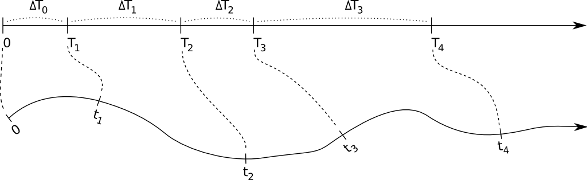
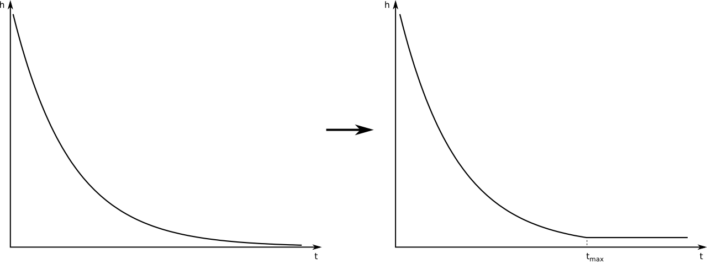

Introduction
============

Like other members of the Simpact family, Simpact Cyan is an 
`agent based model (ABM) <http://en.wikipedia.org/wiki/Agent-based_model>`_ to 
study the way an infection spreads and can be influenced, and is currently 
focused on HIV. 
The program models each individual in a population of a specified
initial size. Things that can happen are represented by *events*, which
can have a certain risk of being executed at a certain moment. Time advances
by iteratively finding the next event that will take place, updating the time
to the corresponding value and executing event-specific code. 
The way this is implemented, is using the *Modified Next Reaction
Method* :ref:`[Anderson] <ref_anderson>`.

Note that event times and time-related properties that can be configured
are expressed in units of years, unless stated otherwise.

Modified Next Reaction Method (mNRM) & hazards
----------------------------------------------

In the mNRM algorithm, there is a core distinction between *internal event times*
and *real-world event times*. The internal event times determine when an event
will go off according to some notion of an internal clock. Let's call the
*internal* time interval until a specific event fires :math:`\Delta T`. Such internal
time intervals are chosen using a simple method, typically as random numbers picked
from an exponential distribution:

.. math::

    {\rm prob}(x)dx = \exp(-x)dx

Events in the simulation will not just use such internal times, they need to be
executed at a certain real-world time. Calling :math:`\Delta t` the real-world time interval 
that corresponds to the internal time interval :math:`\Delta T`, this mapping is done
using the notion of a *hazard* (called *propensity function* in the mNRM article) :math:`h`:

.. math::

    \Delta T = \int_{t_{\rm prev}}^{t_{\rm prev}+\Delta t} h(X(t'), t') dt'

It is this hazard that can depend on the state :math:`X` of the simulation, and perhaps
also explicitly on time. The state of the simulation in our case, can be thought of
as the population: who has relationships with whom, who is infected, how many people
are there etc. This state :math:`X(t)` does *not* continuously depend on time: the state
only changes when events get fired, which is when their internal time interval passes.
Note that the formula above is for a single event, and while :math:`\Delta T` itself is
not affected by other events, the mapping into :math:`\Delta t` certainly can be: other
events can change the state, and the hazard depends on this state.

The figure below illustrates the main idea: internal time intervals are chosen from
a certain distribution, and they get mapped onto real-world time intervals through
hazards. Because hazards can depend both on the state (so the time until an event
fires can be influenced by other events that manipulate this state), and can have an 
explicit time dependency, this mapping can be quite complex:

The hazard can cause complex behaviour, but of course this is not necessarily the case. If
one uses a constant hazard, this simply causes a scaling between internal time :math:`\Delta T`
and real-world time :math:`\Delta t`:

.. math::

    \Delta T = h \Delta t \quad \text{(for a constant hazard)}

This also illustrates that the higher the hazard, the earlier the event will fire, i.e.
the real-world time interval will be smaller.

As an example, let's consider :ref:`formation events <formation>`. At a certain time in
the simulation, many formation events will be scheduled, one event for each man/woman
pair that can possibly form a relationship. The internal time interval for each of
these events will simply be picked from the simple exponential distribution that was
mentioned above. The mapping to a real-world time at which the event will fire, is
calculated using the hazard-based method, and this hazard depends on many things
(the state): how many relationships does the man have at a certain time, how many relationships
does the woman have, what is the preferred age difference etc. One can also imagine
that there can be an explicit time dependency in the hazard: perhaps the hazard of
forming a relationship increases if the time since the relationship became possible
goes up.

Using an exponential distribution to generate an internal time interval is how the
method is described in the :ref:`[Anderson] <ref_anderson>` article. It is of course not absolutely necessary
to do this, and other ways to generate an internal time are used as well. The simplest
example, is if one wants to have an event that fires at a specific time. In that case,
:math:`\Delta T` can simply be set to the actual real-world time until the event needs to fire,
and the hazard can be set to :math:`h=1`, so that internal and real-world time intervals match.
Among others, this is done in the :ref:`HIV seeding <hivseeding>` event which, when triggered, starts the
epidemic by marking a certain amount of people as infected.

Population based simulation
---------------------------

Each time an event is triggered, the state of the simulation is allowed to change. Because
the hazard of any event can depend on this state, in the most general version of the mNRM 
algorithm, one would recalculate the real-world event fire times of all remaining events
each time a particular event gets triggered. This ensures that the possibly changed state
is taken into account.
Recalculating all event fire times all the time, is of course very inefficient: although
the state may have been changed somewhat, this change may not be relevant for many of
the event hazards in use. As a result, the calculated real-world fire times would be mostly the
same as before. 

In the Simpact model, the state can be thought of as the population that is being simulated,
where the population consists of persons. Each person is linked to a list of events
that involve him or her, and if an event is relevant to more than one person it will be
present in the lists of more than one person. For example, a :ref:`mortality event <mortality>`
would be present in the list of only one person, while a :ref:`relationship formation event <formation>`
is about two distinct people and would therefore be present in two such lists. The figure
below illustrates this idea:

.. image:: _static/populationalg.png
    :width: 75%
    :align: center

When an event fires, it is assumed that only the properties of a very limited set of people
have changed, and that one only needs to recalculate the fire times of the events in those
people's lists. For example, if ``Event 2`` from the figure above fires, then the real-world
fire times for the events in the lists of ``Person A`` and ``Person B`` will be automatically
recalculated. Apart from affecting the people in whose lists an event appears, an event can
also indicate that other people are affected. As an example, a :ref:`birth event <birth>` will only
appear in the list of the woman who's pregnant. However, when triggered this event indicates
that the father is also an affected person (in case the amount of children someone has is used
in a hazard). In general, this number of other affected people will be very small compared to
the size of the population, causing only a fraction of the event fire times to be recalculated.
This allows this *population-based algorithm* to run much faster than the very basic algorithm
that always recalculates all event times.

Besides these types of events, there are also 'global' events. These events do not refer
to a particular person and will modify the state in a very general way. In general, when
such a global event is triggered, this causes *all* other event fire times to be recalculated.

.. _timelimited:

'Time limited' hazards
----------------------
 
In the mNRM algorithm, time advances in steps, from one event fire time to the next. In general,
these event fire times are calculated by mapping a generated *internal* time interval :math:`\Delta T` 
onto a *real-world* time interval :math:`\Delta t` using the formula

.. math::

    \Delta T = \int_{t_{\rm prev}}^{t_{\rm prev}+\Delta t} h(X(t'), t') dt'

where :math:`h` is the hazard that can have an explicit time dependency and a dependency on the
simulation state. While the simulation state can change over time, it can only change at discrete
points, when other events change the state. 

The form of the hazard determines how fast this mapping between internal times and real-world times
can be calculated. To keep the simulation as fast as possible, hazards for which the integral has an
analytic solution are certainly most interesting. Furthermore, because the mapping between internal
and real-world times needs to be done in each direction, the resulting equation for :math:`\Delta T`
needs to be invertible as well.

The hazards that we use in the Simpact events are often of the form

.. math::

    {\rm hazard} = \exp(A+Bt)

This is a time dependent hazard where :math:`A` and :math:`B` are determined by other values in the simulation
state. The nice feature of such a hazard is that it is always positive, as a hazard should be (otherwise
the mapping could result in simulation time going backwards). Unfortunately, this form also has a
flaw: consider the example where :math:`A = 0`, :math:`B = -1` and :math:`t_{\rm prev} = 0` 
for conciseness. The mapping between times then becomes

.. math::

    \Delta T = \int_0^{\Delta t} \exp(-t') dt' = 1 - \exp(-\Delta t)

When we need to map a specific :math:`\Delta t` onto an internal :math:`\Delta T`, 
this expression can be used to do this very efficiently. When we need the reverse, rewriting 
this equation gives:

.. math::

    \Delta t = -\log(1-\Delta T)

From this it is clear that it is only possible if :math:`\Delta T` is smaller than one, which may not
be the case since :math:`\Delta T` is picked from an exponential probability distribution in general. The
core problem is that the integral in our expression is bounded, suggesting an upper limit on :math:`\Delta T`,
but on the other hand that :math:`\Delta T` needs to be able to have any positive value since it is
picked from an exponential distribution which does not have an upper limit.

To work around this, we use a slightly different hazard, one that becomes constant after a certain
time :math:`t_{\rm max}`, as is illustrated in the figure below. This has the effect that the integral
will no longer have an upper bound, and the mapping from :math:`\Delta T` to :math:`\Delta t` will always be
possible.

We are calculating a different hazard than before of course, so you may wonder whether this is
really a good idea. In this respect, it is important to note that we're simulating individuals
that will not live forever, but have a limited lifespan. So if we set :math:`t_{\rm max}`
to the time at which the relevant person would be 200 years old (for example), we can be very
sure that our choice for :math:`t_{\rm max}` will not affect the simulation. It only helps to keep
the calculations feasible.

Above, the basic problem and solution are illustrated using a simple time dependent exponential
hazard, but it should be clear that the problem occurs for other hazards as well: one only needs
a hazard for which the integral above is bounded, and since choosing :math:`\Delta T` from an exponential
probability distribution can yield any value, problems will occur. The solution in the general case
is the same: set the hazard to a constant value after a :math:`t_{\rm max}` value which exceeds the
lifetime of a person. The detailed calculations for this procedure can be found in this document:
`hazard_tmax.pdf <_static/hazard_tmax.pdf>`_.

